# RISCV-DV

## Table of contents
- [RISCV-DV](#riscv-dv)
  - [Table of contents](#table-of-contents)
  - [Processor capability Settings](#processor-capability-settings)
  - [Configuration of the generator](#configuration-of-the-generator)
  - [Representation of instructons](#representation-of-instructons)
    - [Base class](#base-class)
    - [Define instructions as subclasses](#define-instructions-as-subclasses)
    - [floating-point instructions](#floating-point-instructions)
    - [vector instructions](#vector-instructions)
    - [Intructions of other extensions](#intructions-of-other-extensions)
    - [Pseudo instruction](#pseudo-instruction)
    - [Illegal/HINT instruction](#illegalhint-instruction)
  - [Generation main body](#generation-main-body)
    - [Overview of the procedures](#overview-of-the-procedures)
    - [Initial construction of function body](#initial-construction-of-function-body)
    - [Setting up callstack among main and sub programs](#setting-up-callstack-among-main-and-sub-programs)
    - [Generating random instruction stream](#generating-random-instruction-stream)
    - [Generating directed instruction stream](#generating-directed-instruction-stream)
      - [Load/Store streams](#loadstore-streams)
      - [AMO streams](#amo-streams)
      - [Loop streams](#loop-streams)
      - [Stack push and pop streams](#stack-push-and-pop-streams)
      - [Jump streams](#jump-streams)
        - [Stream of single jump instruction](#stream-of-single-jump-instruction)
        - [Stress back to back jump instructions](#stress-back-to-back-jump-instructions)
      - [Numeric corner streams](#numeric-corner-streams)
  - [Page tables](#page-tables)
    - [Page table entry and page table](#page-table-entry-and-page-table)
    - [Page table lists: construction and exception handling](#page-table-lists-construction-and-exception-handling)
    - [Exceptions and handling](#exceptions-and-handling)
  - [PMP and ePMP](#pmp-and-epmp)
  - [Handshake between testbench and DUT](#handshake-between-testbench-and-dut)
  - [Instruction generation flow](#instruction-generation-flow)
  - [Appendix](#appendix)
    - [Setting up privileged CSR registers](#setting-up-privileged-csr-registers)
    - [Kernel SP:](#kernel-sp)
  - [References](#references)


## Processor capability Settings
The capacity of the simulated processor is specified in file "target/rv[32|64]xxx/riscv_core_setting.sv", which is included in file "src/riscv_instr_pkg.sv" according specified target option of run.py.

This file includes parameters and key variables specifying the processor capability.

```sv
// Processor features
parameter int XLEN;
privileged_mode_t supported_privileged_mode[];
riscv_instr_name_t unsupported_instr[];
riscv_instr_group_t supported_isa[$];
mtvec_mode_t supported_interrupt_mode[$];
...
// Vector extension parameters
parameter int VECTOR_EXTENSION_ENABLE;
parameter int VLEN;
...
// Multi-harts parameters
parameter int NUM_HARTS = 1;
// Previliged CSR implementation
privileged_reg_t implemented_csr[];
// Supported interrupts/exceptions
interrupt_cause_t implemented_interrupt[];
exception_cause_t implemented_exception[];
```

## Configuration of the generator
The class `riscv_instr_gen_config` is used to hold settings of instruction generation.
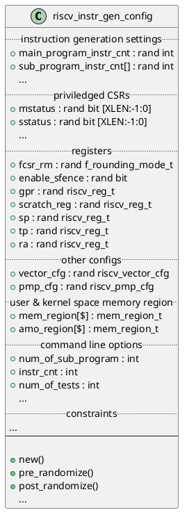

In the function `new`, command line options are handled with regard to the properties in "command line options" part. Also, it creates instances of associated members `vector_cfg` and `pmp_cfg` respectively.

## Representation of instructons
### Base class
A base class `riscv_instr` is defined for the most general instructions. Its members consist of rand operands, helper fields, attributes, static containers for managing supported instructions, a handle for gobal instruction gen config, as well as constraints.

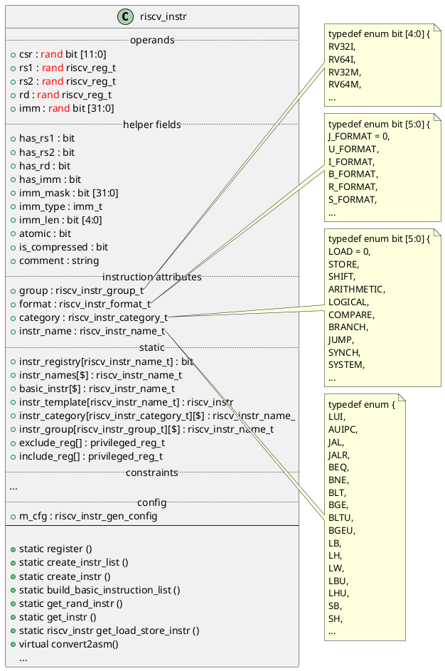

### Define instructions as subclasses
Specific instruction is defined as a subclass of `riscv_insn` with the name `riscv_INSTR_NAME_insn`. 
Each instruction has a static property `valid` which is initialized by calling `riscv_insn::register()`. This function adds a item in the static associated array `riscv_insn::instr_registry`.
In `new` function of instruction-specific subclass, attribute fields of instr_name, format, group, category, imm_type are initialized. Then virtual methods such as `set_imm_len` and `set_rand_mode` are invoked to set other fields according to the attributes.
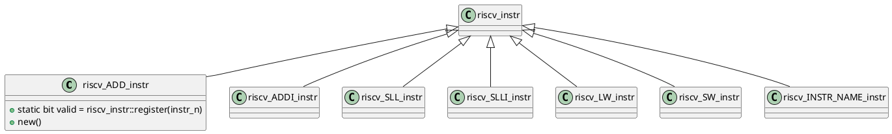
### floating-point instructions
To represent floating-point instructions, a base class `riscv_floating_point_instr` extends the base class of instruction `riscv_instr`, shown in the Figure.
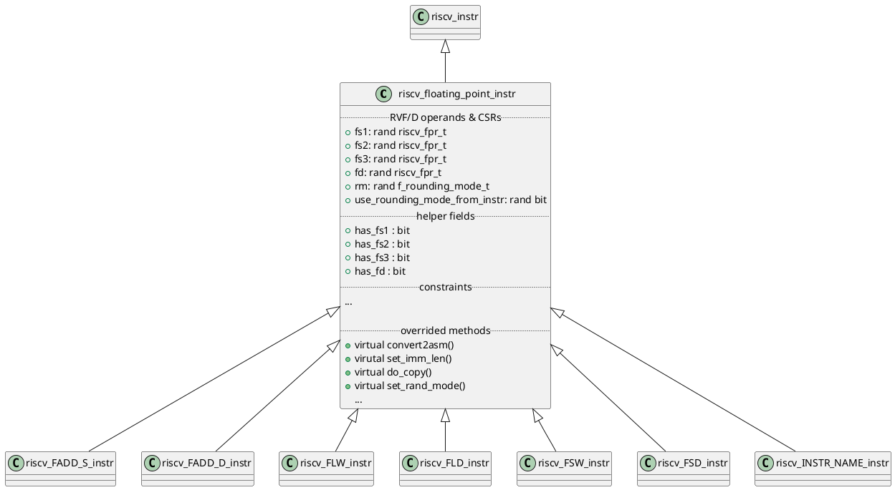
It adds new properties like floating-point operands, related helper fields and constraints. Some of the virtual methods are overrided accordingly.
Similar to integer instructions, floating instructions are subclasses of `riscv_floating_point_instr`. In function `new()`, they registered themselves by `riscv_insn::register()` and initialized properties instr_name, format, group, category, imm_type as well as other fields by calling overrided `set_imm_len` and `set_rand_mode`.

### vector instructions
To represent vector instructions, a base class `riscv_vector_instr` extends the base class of instruction `riscv_floating_point_instr`, shown in the Figure.
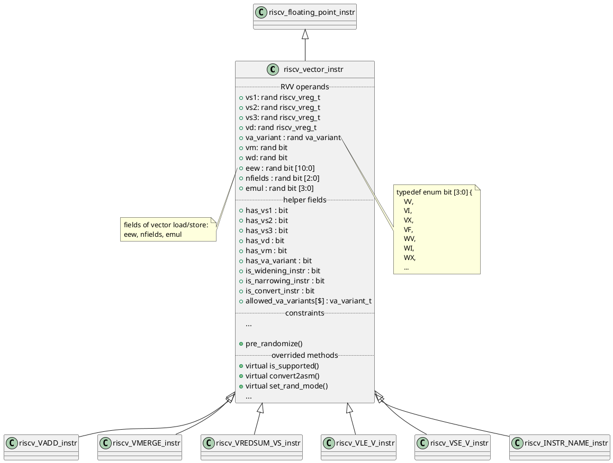
The function `new()` of `riscv_vector_instr` is not trival compared to its parents. It handles the plus command options. An `post_randmize()` mehtod is used to initialized `legal_eew` acccording to random `vtype`.

It adds new properties like vector operands, VA variants, vm bit and related helper fields and constraints. Some of the virtual methods are overrided accordingly.
Similar to integer and floating-point instructions, vector instructions are subclasses of `riscv_vector_instr`. In function `new()`, they registered themselves by `riscv_insn::register()` and initialized properties instr_name, format, group, category, imm_type, allowed_va_variants, sub_extension as well as other fields by calling overrided `set_imm_len` and `set_rand_mode`.

Note:
- function `new()` of base `riscv_vector_instr` and those of instrction-specific class `riscv_INSTR_NAME_instr` are different things.

The CSRs of RVV are defined in a separate configuration class `riscv_vector_cfg` which is instatiated as a member of the top-level configuration class `riscv_instr_gen_config`. Most of these RVV CSR related fields are rand variables. The function `new()` of this class handles plus command options. And the function `post_randomize()` initialized un-random field `legal_eew` according to randomly generated `vtype`.

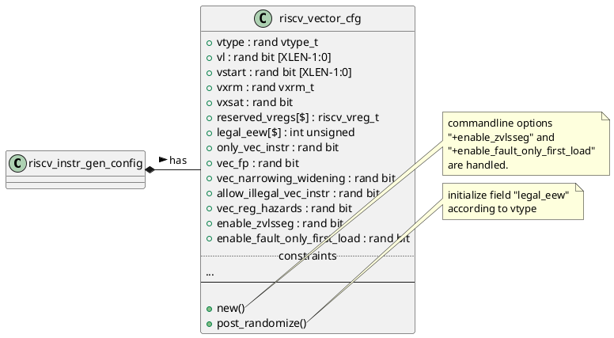

### Intructions of other extensions
The same way is used to define instructions of other extensions. That is, a base class `riscv_EXT_NAME_instr` extends the base class of instruction `riscv_floating_point_instr`. In the subclasses of extensions, there are random extension-specific operands, related fields and constraints. Methods of base class are overrided, such as `is_supported()`, `set_rand_mode()`, `convert2asm()`, `do_copy()` etc.
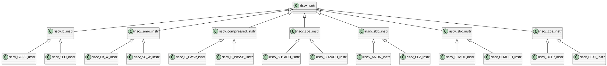
The instructions thereof are subclasses of `riscv_EXT_NAME_instr`. In function `new()`, they registered themselves by `riscv_insn::register()` and initialized properties instr_name, format, group, category, imm_type as well as other fields by calling overrided `set_imm_len` and `set_rand_mode`.

### Pseudo instruction
Only two pseudo instructions are defined so far, which are LI and LA. They are in the same format and are modeled in class `riscv_pseudo_instr`, which also means the class may not suitable for other pseduo instructions in different format.

Class `riscv_pseudo_instr` is a subclass of `riscv_instr` as below.

Note:
- Pseudo instructions is not registered in the static members of 'riscv_instr', which is different from other native instructions.

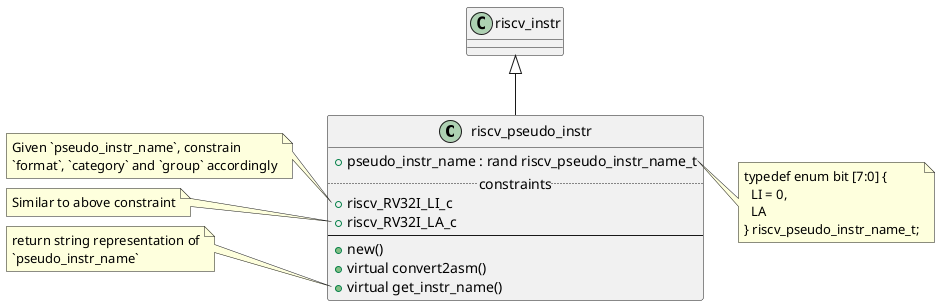
To create an pseudo instruction, create a instance of `riscv_pseudo_instr`. And set `pseudo_instr_name` to LI or LA, and set `rd` and `imm_str`. 
The created instance as an element of `riscv_instr_stream::instr_list[$]`, is the same as other native instructions, for which the asm string can be got by calling `convert2asm()`.

### Illegal/HINT instruction
The illegal/HINT instructions are defined by instances of class `riscv_illegal_instr`. It is different from ordinary instructions in two aspects. First, all illegal/HINT instruction are **instances** of this class only. The other one is the class is inherited from `uvm_object` rather than `riscv_instr`.

The illegal/HINT instructions will be generated in binary format. In `riscv_instr_sequence::insert_illegal_hint_instr()`, it first calls method `init()` of its member `illegal_instr` that is a handle of the `riscv_illegal_instr`. Then it calls `randomize()` to generate one illegal/HINT instruction and appends its binary format to `riscv_instr_sequence::instr_string_list[$]`. This process is repeated a few times corrresponding to `cfg.illegal_instr_ratio` for inserting multiple ones.

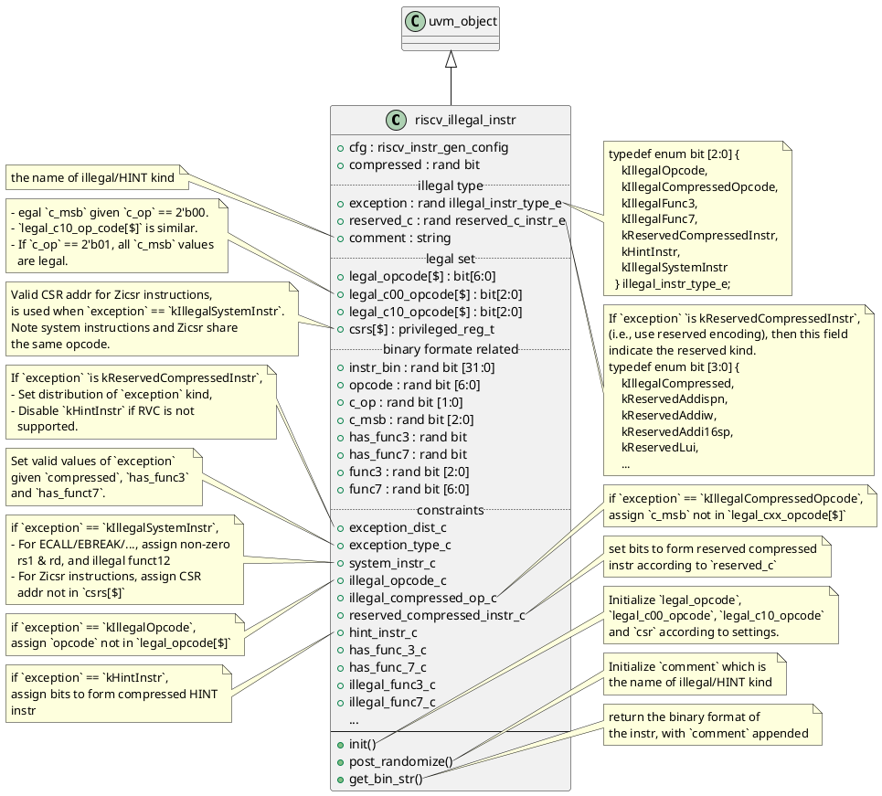

Note:
- Only HINT instructions of RVC are generated, which are specified in constraint `hint_instr_c`.
- Illegal isntruction is generated by excluding legal related fields or using reserved encodings.
- Generation of illgegal instructions of Extension B and AMO are not supported so far.

## Generation main body
The main body of the generated assmembly file consists of a main function and a few sub functions. The figure below demonstrates the tree structure of the calling graph of these functions.

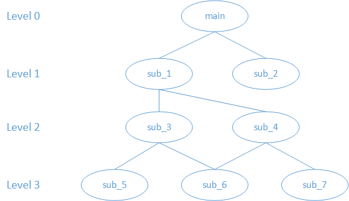

### Overview of the procedures
The procedures to generate main body of test program with main and sub functions are listed as below.
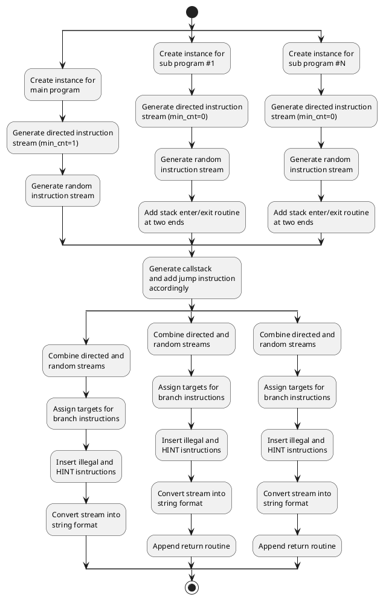
Here is the pseudo code to generate the main body following the procedures.
```sv
// Similar snippets in src/riscv_asm_program_gen.sv
//===== Create instance of main/sub program (riscv_instr_sequence) =====//
program[hart] = riscv_instr_sequence::type_id::create(get_label("main/sub", hart));

//===== Initialize fields of the program =====//
program[hart].instr_cnt = cfg.main/sub_program_instr_cnt;
program[hart].is_debug_program = 0;
program[hart].label_name = main/sub_program[hart].get_name();

// Generate directed instruction stream, i.e., initialize riscv_instr_sequence.directed_instr
generate_directed_instr_stream(.hart(hart),
                               .label(main_program[hart].label_name),
                               .original_instr_cnt(main_program[hart].instr_cnt),
                               .min_insert_cnt(1/0),
                               .instr_stream(main_program[hart].directed_instr));
// The cfg field is retrieved from that in uvm_test_top, and assigned to internal instruction stream's and directed stream's cfgs.
program[hart].cfg = cfg;

//===== Solve random variables recursively =====//
`DV_CHECK_RANDOMIZE_FATAL(program[hart])

//===== Genenerate random instruction stream =====//
main_program[hart].gen_instr(.is_main_program(1/0), .no_branch(cfg.no_branch_jump));

//===== Something here to set up callstack =====//
gen_callstack(main_program[hart], sub_program[hart], sub_program_name,
              cfg.num_of_sub_program);

//===== assign forward targets for branch instructions =====//
// Insert directed instructions at first
program[hart].post_process_instr();

//===== Convert instruction stream into string format =====//
program[hart].generate_instr_stream();
```

### Initial construction of function body
Each bubble in the calling graph represent the instructions of a single function. In RISCV-DV, it is modeled as a class `riscv_instr_sequence`.
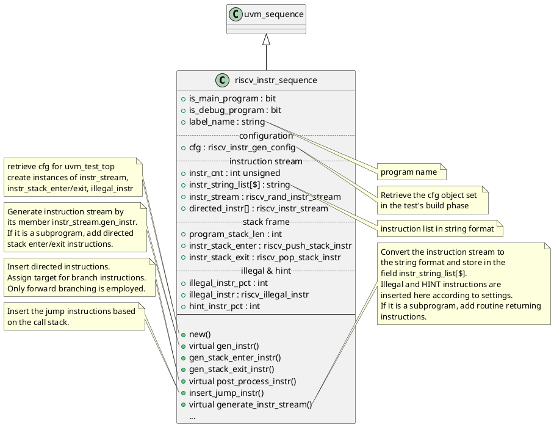
Note for method `post_process_instr()`:
- First it inserts directed instructions, which randomly mixed with randomly generated ones.
- Then for each instruction in the stream that is "has_label" and isn't "atomic", randomly set the flags `is_illegal_instr` and `is_hint_instr` according to fileds `illegal_instr_pct` and `hint_instr_pct` respectively. (Note: the two flags here are not used in current project.)
- In the same loop above, it sets the `label` and `is_local_numeric_label` of the "has_label" and non "atomic" instruction. **WARNING: Atomic stream does not have a label as the same format as others. Will this cause problem when an atomic stream is selected as the branch target?**
- Only forward branching is employed, since it may be too complex for chosing the exit condition for a backward braching to avoid inifite loop. Backward branching is implemented as directed stream.
- Next, randomly generate a list of 30 targets `branch_idx` that in [1:cfg.max_branch_step], which means how many steps forward from the branch instruction
- For each unassigned branch instrution, select a valid target step. It picks one from the `branch_idx` successivley. If all 30 steps are used, shuffle them and pick from the first one again. If the selected step is out of range (>= label_idx), choose the last valid instruction.
- Assign branch target according to selected branch steps by setting `imm_str`, `imm` and `branch_assigned`. Update the associative array `branch_target` for bookkeeping the idx that as a target.
- Remove the local label which is not used as branch target.

Note for method `generate_instr_stream()`:
- format each string-format instruction in `instr_stream.instr_list` with consistent indentation, and append it to field `instr_string_list[$]`.
- insert illegal/HINT instruction with the proportion specified by `cfg.illegal_instr_ratio` and `cfg.hint_instr_ratio` respectively. These instructions are in hexadecimal number of 4 bytes in string format and inserted to random positions within `instr_string_list[$]`.
- For subprograms, it adds return routines at the end of `instr_string_list[$]`. This is implemented as randomly set the LSB of `cfg.ra` to one (JALR will zero it out), and jump to that address.

In the one of the main top-level mehtod `riscv_asm_program_gen::gen_program()` and `riscv_asm_program_gen::gen_sub_program()`, the objects of above `riscv_instr_sequence` are created by factory. Then its methods are called from the caller `gen_program()` and `gen_sub_program` to construct instruction streams respectively.

### Setting up callstack among main and sub programs
To avoid infinite call loop, the call graph between programs are tree-like data structure that is loop free.
> Constraints of callstack generation:
> - A program can only call the program in the next level.
> - A program can be called many times by other upper level programs.
> - A program can call the same lower level programs multiple times.

The callstack is modeled by the class `riscv_callstack_gen`.
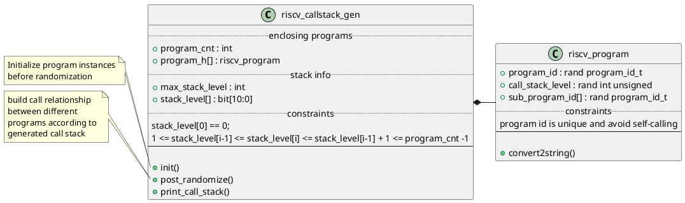
Note on `riscv_callstack_gen::post_randomize()`:
- Assign the `stack_level` field of each program by the value of generated `stack_level[program_cnt]` with the same index
- Build the call relationship in a top-down way. Starting from level 0, use `program_list[$]` and `next_program_list[$]` collects program ids in two back-to-back levels respectively.
- Next, build `sub_program_id_pool[]` with the ids in `next_program_list[$]`, and shuffle them. (May duplicate one id in `next_program_list[$]` to make it possible to call the same sub program in one program multiple times.)
- Randomly assign the number of sub programs for each program, making their sum equal to the size of `sub_program_id_pool[]`
- Initialize the `sub_program_id` fields of the programs in `program_list[$]` by the values in `sub_program_id_pool[]` wit the same index

When generating assembly test file, `riscv_asm_program_gen::gen_callstack` creates an instance of `riscv_callstack_gen`. Initialize it with the total number of main and sub programs before randomization.
Then the method `riscv_asm_program_gen::gen_callstack` inserts jump instructions based on the generated callstack.

### Generating random instruction stream
- Load/Store instructions are not generated here. They are generated as directed instruction stream.
- Branch instructions is turned on/off by `cfg.no_branch_jump`.

`riscv_instr_sequence::gen_instr()` is called to generate the random instruction streamin `riscv_asm_program_gen` when creating main and sub programs. It in turn calls `instr_stream.gen_instr()` (of class `riscv_rand_instr_stream`) that generates each instruction one by one with a separate randomization call.
> This not done by a single randomization call for the entire instruction stream because this solution won't scale if we have hundreds of thousands of instructions to generate. The constraint solver slows down considerably as the instruction stream becomes longer. The downside is we cannot specify constraints between instructions. The way to solve it is to have a dedicated directed instruction stream for such scenarios, like hazard sequence.


`riscv_rand_instr_stream::gen_instr()` sets up the `include_instr[$]` and `exclude_instr[$]`, then further in turn pass them to static function `riscv_instr::get_rand_instr()` to randomly select one instruction that is in `include_instr[$]` but not in `exclude_instr[$]`.

Note variable name inconsistency here:
- Distinguish `allowed_instr[$]` in `riscv_rand_instr_stream` and `riscv_instr::get_rand_instr()`. For the former, it is mostly from `riscv_instr::basic_instr` that consists of arithmetic, shift, logic, compare instructions etc. And it becomes `include_instr[$]` in the latter when calling from the former to the latter. For the latter, `allowed_instr[$]` is a local variable setting up according to `include_category[$]` and `include_category[$]` and used when `include_instr[$]` is empty.

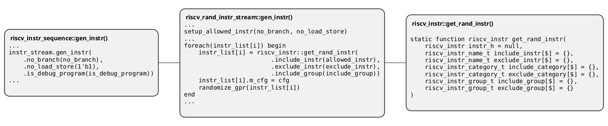

Let's detour a little bit to cover class `riscv_instr_stream` and `riscv_rand_instr_stream`, which is the main data strutcture for instruction streams which are random or directed.

`riscv_instr_stream` is the base class of instruction stream, which is a queue of RISC-V base instructions `riscv_instr`. This class also provides some functions to manipulate the instruction stream, like insert a new instruction, mix two instruction streams etc.

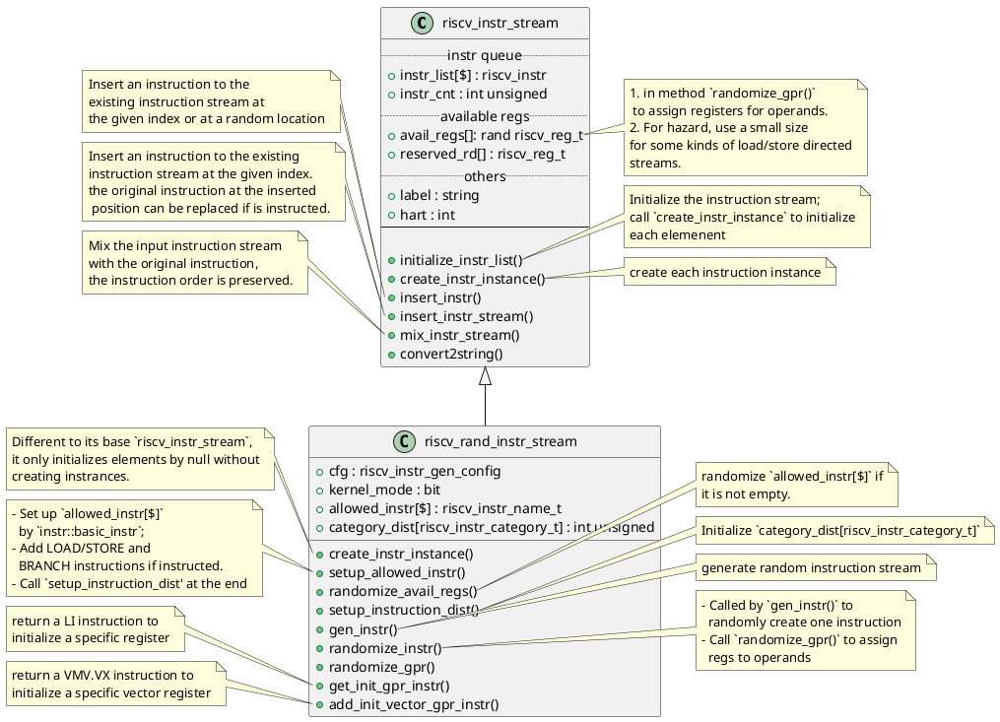

Note:
- `category_dist[riscv_instr_category_t]` is not used when generate random instructions. Now it is randomly picked from available ones.
- Compared to its base `riscv_instr_stream`, `create_instr_instance()` of `riscv_rand_instr_stream` only initializes elements by null without creating instrances. **Thus, for an instance of `riscv_rand_instr_stream`, calling `initialize_instr_list()` will not creat instance for the elements of `instr_list[$]`.**
- `avail_regs[$]` should be specified its size before randomizing by `randomize_avail_regs()`

### Generating directed instruction stream
A directed instruction stream is a subclass of `riscv_rand_instr_stream`, since some random instructions are mixed into directed ones (by `gen_instr()` and `mix_instr_stream()`) and methods thereof are used for register randomization.

Directed instrution streams are inserted into programs in two ways:
- inject according to command line options
- inject for specific functionality, e.g. enter/exit stack, function call and return

For injecting according to command line options, there are two syntax:
```sv
//+directed_instr_n=instr_stream_name,frequency(number of insertions per 1000 instructions)
+directed_instr_5=riscv_multi_page_load_store_instr_stream,4

// An alternative command line options for directed instruction stream
+stream_name_0=riscv_multi_page_load_store_instr_stream
+stream_freq_0=4
```
In the run_phase() of the base test, it calls `riscv_asm_program_gen::get_directed_instr_stream()` to parse the plusargs and initialize `riscv_asm_program_gen::directed_instr_stream_ratio[string]` accordingly.

Then when generating main/sub programs in `riscv_asm_program_gen`, method `generate_directed_instr_stream` is invoked to generate commandline specified directed streams which are handled by the corresponding program's (aka. `riscv_instr_sequence`) `directed_instr[]`.

The minimum insertion count of these directed streams are 1 for main program and 0 for sub sub programs, which makes sure they are at least inserted in the main program.

Class `riscv_directed_instr_stream` is the base class for directed instruction stream.

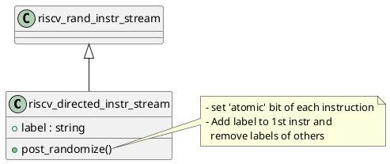
Here is the inheritance diagram of the classes of directed streams. The classes with grey background are all directed streams of RISCV-DV.

Note that some of them are inheirted from `riscv_rand_instr_stream` directly, rather than from `riscv_directed_instr_stream`, such as `riscv_jal_instr`, `riscv_loop_instr`, `riscv_push_stack_instr` and `riscv_pop_stack_instr`. For them, fields `atomic`, `has_label` etc., are changed by methods thereof.

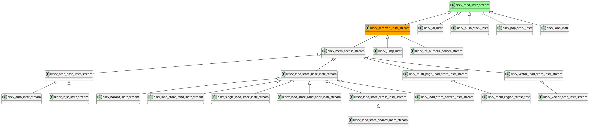

#### Load/Store streams
Why it would be better handle load/store instructions by directed streams?
- Requirement of density to make the test with some kind of stress, as well as the locality of instructions with data hazard
- Since load/store instructions are related to specified data pages, it is not efficient to get `rs1` restored every time before a load/store.
- If load from unpreloaded page, use store to initialze first

The load-store directed streams stem from `riscv_mem_access_stream` or `riscv_load_store_base_instr_stream`. Here are the features of these two base classes.

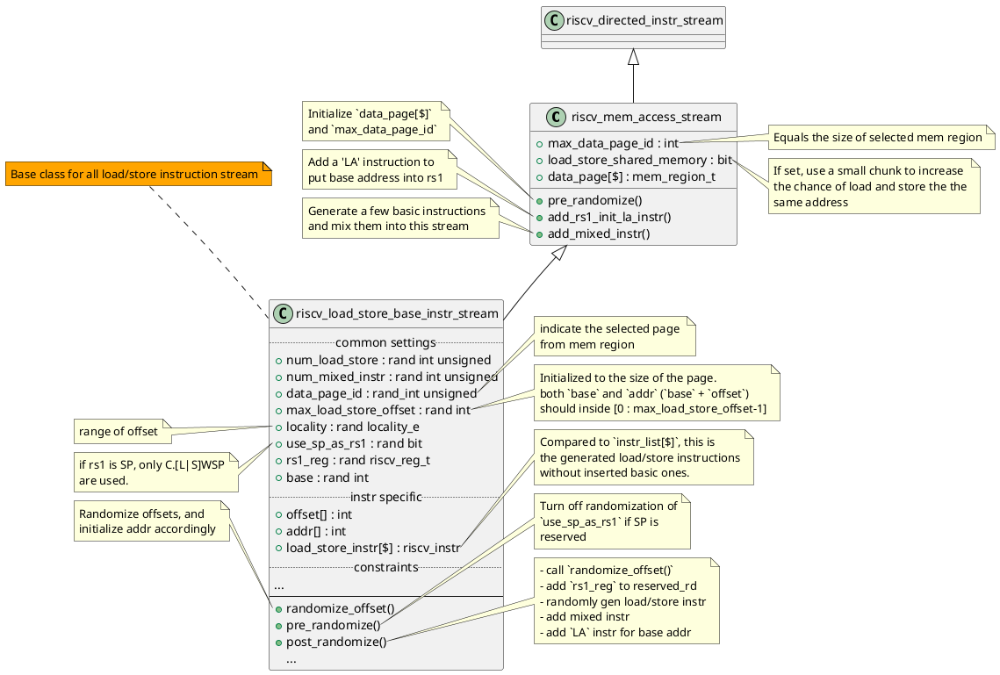

Most integer load/store streams are subclasses as shown in the diagram, which are used for different purposes with corrensponding constraints.

```plantuml
@startuml
class riscv_mem_access_stream
class riscv_load_store_base_instr_stream

package "derived streams" {

riscv_mem_access_stream <|-- riscv_load_store_base_instr_stream

riscv_load_store_base_instr_stream <|-- riscv_single_load_store_instr_stream
note bottom of riscv_single_load_store_instr_stream #orange
A single load/store instruction
endnote

riscv_load_store_base_instr_stream <|-- riscv_load_store_stress_instr_stream
note bottom of riscv_load_store_stress_instr_stream #orange
Back to back load/store instructions,
No basic instruction is mixed into.
endnote

riscv_load_store_stress_instr_stream <|-- riscv_load_store_shared_mem_stream
note bottom of riscv_load_store_shared_mem_stream #orange
Use small data page for load/store
to share addresses
endnote

riscv_load_store_base_instr_stream <|-- riscv_load_store_rand_instr_stream
note bottom of riscv_load_store_rand_instr_stream #orange
Random load/store sequence. Constraints:
<code>
num_load_store inside {[10:30]};
num_mixed_instr inside {[10:30]};
</code>
endnote

riscv_load_store_base_instr_stream <|-- riscv_hazard_instr_stream
note bottom of riscv_hazard_instr_stream #orange
Use a small set of GPR to create
various WAW, RAW, WAR hazard scenario.
endnote

riscv_load_store_base_instr_stream <|-- riscv_load_store_hazard_instr_stream
note bottom of riscv_load_store_hazard_instr_stream #orange
specify a `hazard_ration`, which is
the probability of two back-to-back
load/store use the same address
endnote

riscv_mem_access_stream <|-- riscv_multi_page_load_store_instr_stream

note bottom of riscv_multi_page_load_store_instr_stream #orange
to test data TLB switch and replacement.
Mixed multiple instances of `riscv_load_store_stress_instr_stream`
with different data page ids together
endnote

riscv_multi_page_load_store_instr_stream <|-- riscv_mem_region_stress_test
note bottom of riscv_mem_region_stress_test #orange
Access the different locations of the same page.
Maybe duplicate `riscv_load_store_base_instr_stream`?
endnote

riscv_load_store_base_instr_stream <|-- riscv_load_store_rand_addr_instr_stream
note bottom of riscv_load_store_rand_addr_instr_stream #orange
- Random load/store sequence to full address range.
  The address range is not preloaded with data 
  pages, use store instruction to initialize first.
- Override `add_rs1_init_la_instr`, use `LI` and `ADD`
  for a far stride of [N * 1MB - 2KB, N * + (2K-1)B]
endnote
}
@enduml
```

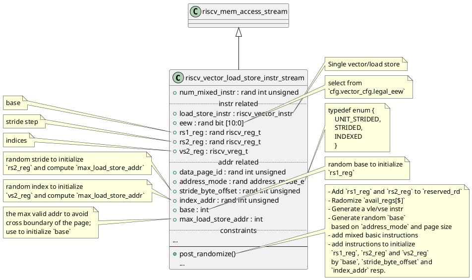
Note of the limitation of `riscv_vector_load_store_instr_stream`:
- Only one vector load/store is in the stream, which does not introduce hazard
- For indexed vector load/store, all the indices are the same.

#### AMO streams
As AMO instructions also use `rs1` for the address of memory operation. The base class of AMO stream `riscv_amo_base_instr_stream` inherits from `riscv_mem_access_stream`.

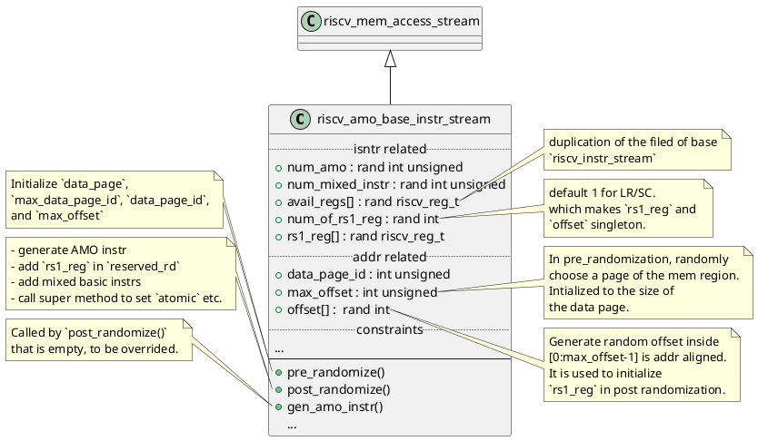
Based on it, LR/SC instruction sequence are defined as below. A pair the LR/SC is generated and only instrucions of extension I or integer arithmetic of extension C are inserted in-between.
```plantuml
@startuml
class riscv_lr_sc_instr_stream{
    + lr_instr : riscv_instr
    + sc_instr : riscv_instr
    .. constraints ..
    ...
    --
    + gen_amo_instr()
    + add_mixed_instr()
}
note right of riscv_lr_sc_instr_stream::gen_amo_instr
- Randomly generate valid instr
  for `lr_instr` and `sc_instr`.
- `rs1` is set to `rs1_reg[0]`
  `rd` is randomly generated, 
  and not the same as `rs1`
- Insert them into `instr_list[$]`
endnote
note left of riscv_lr_sc_instr_stream::add_mixed_instr
Since only mixed in RV32I, RV32C,
according requirements of the spec.
endnote
riscv_amo_base_instr_stream <|-- riscv_lr_sc_instr_stream
@enduml
```

Similarly, RMW instructions of AMO are also defined by derived class `riscv_amo_instr_stream` of `riscv_amo_base_instr_stream`.
```plantuml
@startuml
class riscv_amo_instr_stream{
    + amo_instr[] : riscv_instr
    .. constraints ..
    ...
    + gen_amo_instr()
}
note right of riscv_amo_instr_stream::gen_amo_instr
- generate instrs from AMO category
- Select `rd` from `reserved_rd[]`
- Select `rs1` from `rs1_reg[]`
endnote
riscv_amo_base_instr_stream <-- riscv_amo_instr_stream
@enduml
```
In the file src/riscv_amo_instr_lib.sv, class `riscv_vector_amo_instr_stream` is define for Zvamo, which is an incomplete version. Its method `add_element_vec_load_stores` has not been used as `allowed_instr[$]` when generate instructions.

#### Loop streams
The stream is an random loop code snippet by backward branching. It is a single loop or two nested loops by randomization. The generated code looks like (the case of two nested loops):
```asm
## Outer loop
## Loop init
addi x11, zero, loop_init_val[1] # init loop cnt
addi x12, zero, loop_limit_val[1] # init loop limit
sub_1_1_t:
mul x20, x11, x12 # branch target, any ARITHMETIC/LOGIC/COMPARE instr, excluding c.addi16sp
addi x11, x11, loop_step_val[0] # update loop cnt
    ## Inner loop
    ## Loop init
    addi x13, zero, loop_init_val[0] # init loop cnt of outer loop
    addi x14, zero, loop_limit_val[0] # init loop limit of outer loop
    sub_1_0_t:
    xor x20, zero, x11 # branch target, any ARITHMETIC/LOGIC/COMPARE instr, excluding c.addi16sp
    addi x13, x13, loop_step_val[0] # update loop cnt
    beq sub_1_0_t, x13, x14
beq sub_1_1_t, x11, x12
```
Generated basic instructions are randomly inserted in above sequence in a "contained" manner.

```plantuml
@startuml
class riscv_loop_instr{
    .. loop settings ..
    + num_of_nested_loop : rand bit [2:0]
    + num_of_instr_in_loop : rand int    
    + loop_cnt_reg[] : rand riscv_reg_t
    + loop_limit_reg[] : rand riscv_reg_t
    + branch_type[] : rand riscv_instr_name_t
    .. loop instr ..
    + loop_init_instr[] : riscv_instr
    + loop_update_instr[] : riscv_instr
    + loop_branch_instr[] : riscv_instr
    + loop_branch_target_instr[] : riscv_instr
    + loop_instr[] : riscv_instr
    .. constraints ..
    ...
    --
    + post_randomize()
    ...
}
note right of riscv_loop_instr::num_of_nested_loop
    1 or 2 (nested)
endnote
note right of riscv_loop_instr::num_of_instr_in_loop
    number of basic instrs to be mixed in
endnote
note right of riscv_loop_instr::loop_cnt_reg
    loop_cnt_reg[i] for the i-th loop
endnote
note right of riscv_loop_instr::loop_limit_reg
    loop_limit_reg[i] for the i-th loop
endnote
note left of riscv_loop_instr::branch_type
    valid branch instrs used as `include_instr`
    for random selection
endnote
note left of riscv_loop_instr::loop_init_instr
    two for initialize cnt
    and limit resp.
endnote
note left of riscv_loop_instr::loop_instr
    Compared to `instr_list[$]`, this is
    the generated minimum loop instructions
    without inserted basic ones.
endnote
note right of riscv_loop_instr::post_randomize
- Add `loop_cnt_reg` and `loop_limit_reg` to `reserved_reg`
- Intialize `instr_list[$]` by random basic instrs
- Initalize `loop_instr[$]` with the loop-related instrs
- Mix loop instrs in
- Set `atomic` and `has_label` fields
endnote
riscv_rand_instr_stream <|-- riscv_loop_instr
@enduml
```
Note:
- Nested loops are constructed from innermost to outermost
- Constraints should make sure branch condition will fail eventally
  - loop counter will equal to limit for `BEQ`, `BNE` etc.
  - the sign of step of loop counter is consistent with condition, such as step < 0 for `BGE`.

#### Stack push and pop streams

```plantuml
@startuml
class riscv_push_stack_instr{
    + stack_len : int
    + num_of_reg_to_save : int
    + num_of_redudant_instr : int
    + push_stack_instr[] : riscv_instr
    + saved_regs[] : riscv_instr
    .. trivial branch ..
    + enable_branch : rand bit
    + branch_instr : riscv_instr
    + push_start_label : string
    --
    + init()
    + gen_push_stack_instr()
}

class riscv_pop_stack_instr{
    + stack_len : int
    + num_of_reg_to_save : int
    + num_of_redudant_instr : int
    + pop_stack_instr[] : riscv_instr
    + saved_regs[] : riscv_instr
    --
    + init()
    + gen_pop_stack_instr()
}

note right of riscv_push_stack_instr::num_of_reg_to_save
size of `saved_regs[]`
endnote
note right of riscv_push_stack_instr::enable_branch
Randomly insert a heading branch with target
to the first instr of `push_stack_instr[]`
endnote
note right of riscv_push_stack_instr::gen_push_stack_instr
the function to call to 
generate directed stream
endnote
note left of riscv_pop_stack_instr::gen_pop_stack_instr
the function to call to 
generate directed stream
endnote
riscv_rand_instr_stream <|-- riscv_pop_stack_instr
riscv_rand_instr_stream <|-- riscv_push_stack_instr
@enduml
```
Note on pushing to stack:
- default to save `cfg.ra`, also add it to `reserved_rd`
- (`num_of_reg_to_save` + 1) instructions in `push_stack_instr[]`. The first one is `ADDI` to creat a frame, and followed by `num_of_reg_to_save` store instructions to save regs
- If `enable_branch` set, randomly put a branch instruction with the start of "pushing" instrs. The purpose here is to cover branch -> jump scenario.

Note on poping from stack:
- When calling `gen_pop_stack_instr()`, the `saved_regs[]` and `num_of_reg_to_save` are usually initialized by the `saved_regs[]` of an instance of `riscv_push_stack_instr`.
- - (`num_of_reg_to_save` + 1) instructions in `pop_stack_instr[]`. The first `num_of_reg_to_save` ones are load instructions to restore regs, and followed by `ADDI` to remove the frame.

#### Jump streams

##### Stream of single jump instruction
The stream consists of the following instructions. When used, an instance of class `riscv_jump_instr` is created and assign field `target_program_label` by the label of jump target.

```asm
la rd0, jump_tagert_label
addi rd1, offset, rd0
jalr rd, offset, rd1
## For JAL, restore the stack before doing the jump
```

Note:
- If this jump stream is used for a subprogram to call a subroutine (e.g. riscv_instr_sequence::insert_jump_instr()), also assign `stack_exit_instr[]` by instructions popping from the stack. The reason is that in case rd == x0 or c.jr is selected, we need to remove current frame since no ra is saved.
- If enable_branch is set, a branch is added right before the jump instruction that is also the branch target. The purpose here is to cover branch -> jump scenario.

Here is the definition of class `riscv_jump_instr`.
```plantuml
@startuml
class riscv_jump_instr{
    + mixed_instr_cnt : rand int
    + stack_exit_instr[] : riscv_instr
    .. instrs ..
    + la : riscv_pseudo_instr
    + addi : riscv_instr
    + jump : riscv_instr          
    + use_jalr : bit
    .. target label gen ..
    + target_program_label : string
    + idx : int
    .. jump addr related ..
    + gpr : rand riscv_reg_t
    + imm : rand int
    .. trivial branch ..
    + enable_branch : rand bit
    + branch : riscv_instr
    --
    + new()
    + pre_randomize()
    + post_randomize()
}
note right of riscv_jump_instr::use_jalr
Use jalr as the jump instr
endnote
note right of riscv_jump_instr::idx
To form the label of jump instr.
It is assigned by 
`riscv_isntr_sequence::insert_jump_instr()`,
used to enumerate function calls.
endnote
note right of riscv_jump_instr::gpr
the rs1 as base address
endnote
note right of riscv_jump_instr::imm
- the negative value of offset of jump instr.
- first add base addr by `ADDI` with imm
- then use jump instr with offset "-imm"
endnote
note left of riscv_jump_instr::new
creat an instance of pseudo instr `LA`,
since it is not registered, and cannot 
be generated via `riscv_instr::get_instr()`.
endnote
note left of riscv_jump_instr::pre_randomize
creat instances of jump, addi, and branch
endnote
note left of riscv_jump_instr::post_randomize
- generate random stream
- randomly generate and resolve 
operands of instrs
- mixed directed instrs with random ones
- set flags 'atomic' and 'has_label'
endnote
riscv_directed_instr_stream <|-- riscv_jump_instr
@enduml
```
##### Stress back to back jump instructions
The stream consists of a sequence of back-to-back jump instructions. Each jump instruction except the first and last one has an index, and it jumps to next one with next index.

Note:
- The field `imm_str` of `jump_end` should be specified by the target of the last jump instruction.

Class `riscv_jal_instr` defines the back-to-back jump instruction stream.

```plantuml
@startuml
class riscv_jal_instr{
    + jump[] : riscv_instr
    + jump_start : riscv_instr
    + jump_end : riscv_instr
    + num_of_jump_instr : rand int unsigned
    + jal[$] : riscv_instr_name_t
    --
    + post_randomize()
}
note left of riscv_jal_instr::num_of_jump_instr
The number of jump instr
except the first and last.
endnote
note left of riscv_jal_instr::jal
Available jump instr
to be randomly selected.
endnote
note right of riscv_jal_instr::post_randomize
- Generate order sequence 
  from 0 to `num_of_jump_instr`-1
- Set target of `jump_start` to
  the instr of `jump[]` with order[0]
- Set the label of `jump_end` to
  string form of `num_of_jump_instr`
- Set the targets of instrs `jump[]`,
  the instr with order[num_of_jump_instr-1]
  jumps to `jump_end`
- Set fields `atomic` and `has_label`
endnote
riscv_rand_instr_stream <|-- riscv_jal_instr
@enduml
```

#### Numeric corner streams
This stream is of integer arithmetic instructions with corner-case numerical operands. It first initializes ten regs with corner-case values, then randomly generates a few integer arithmetic instructions whose operands are these regs.

The relevant class is `riscv_int_numeric_corner_stream` defined as below.

```plantuml
@startuml
class riscv_int_numeric_corner_stream{
    .. regs related ..
    + num_of_avail_regs : int unsigned
    + init_val[] : rand bit [XLEN-1:0]
    + init_val_type[] : rand int_numeric_e
    + init_instr[] : riscv_pseudo_instr
    .. rand integer arithmectic instrs ..
    + num_of_instr : rand int unsigned
    --
    + pre_randomize()
    + post_randomize()
}
note right of riscv_int_numeric_corner_stream::num_of_avail_regs
the size of `avail_regs[]`, as well as
`init_val[]` and `init_val_type[]`.
endnote
note right of riscv_int_numeric_corner_stream::init_val_type
typedef enum {
    NormalValue,
    Zero,
    AllOne,
    NegativeMax
  } int_numeric_e;
endnote
note right of riscv_int_numeric_corner_stream::init_instr
heading `LI` instrs to initialize
elements of `avail_regs[]` with corner-
case values in `init_val[]`
endnote
note left of riscv_int_numeric_corner_stream::pre_randomize
Assign the size of `avail_regs[]` to `num_of_avail_regs`.
endnote
note left of riscv_int_numeric_corner_stream::post_randomize
- Initialize elements of `avail_regs[]` with 
  corner-case values in `init_val[]`.
- Append random integer arithmetic instructions 
  whose operands are selected from `avail_regs[]`.
endnote
riscv_directed_instr_stream <|-- riscv_int_numeric_corner_stream
@enduml
```

## Page tables
Let's walk through the code of page tables in a bottom-up way. 

### Page table entry and page table
A page table entry (pte) is defined as an instance of class `riscv_page_table_entry`, which is parameterized by a parameter `MODE` indicating the field of satp register.

```plantuml
@startuml
class riscv_page_table_entry{
    -- Parameters --
    MODE : satp_mode_t
    PPN0_WIDTH : int
    PPN1_WIDTH : int
    PPN2_WIDTH : int
    PPN3_WIDTH : int
    RSVD_WIDTH : int
    VPN_WIDTH : int
    VADDR_SPARE : int
    VADDR_WIDTH : int
    --
    .. fields ..
    + bits : rand bit [XLEN-1:0]
    + v : rand bit
    + xwr : rand pte_permission_t
    + u : rand bit
    + g : rand bit
    + a : rand bit
    + d : rand bit
    + rsw : rand bit [1:0]
    + ppn0 : rand bit [PPN0_WIDTH-1:0]
    + ppn1 : rand bit [PPN1_WIDTH-1:0]
    + ppn2 : rand bit [PPN2_WIDTH-1:0]
    + ppn3 : rand bit [PPN3_WIDTH-1:0]
    + rsvd : rand bit [RSVD_WIDTH-1:0]
    .. addr info ..
    + starting_pa : bit [XLEN-1:0]
    + starting_va : bit [XLEN-1:0]
    ...
    .. constraints ..
    // constrain `a` & `d` to 1
    // and other fields to 0
    --
    + turn_off_default_constraint()
    + pack_entry()
    + post_randomize()
    + do_copy()
    + convert2string()
    + set_ppn()
}
note left of riscv_page_table_entry::MODE
typedef enum bit [3:0] {
    BARE = 4'b0000,
    SV32 = 4'b0001,
    SV39 = 4'b1000,
    SV48 = 4'b1001,
    SV57 = 4'b1010,
    SV64 = 4'b1011
  } satp_mode_t;
endnote
note right of riscv_page_table_entry::PPN3_WIDTH
typedef enum bit [3:0] {
Note: 1 means not exist,
similar to `PPN2_WIDTH`,
and `RSVD_WIDTH`
endnote
note right of riscv_page_table_entry::RSVD_WIDTH
The number of bits of
reserved heading bits
before PPNs.
endnote
note left of riscv_page_table_entry::VADDR_SPARE
Spare bits in VA:
XLEN - # bits of VA;
0 for no spare bits.
endnote
note left of riscv_page_table_entry::VADDR_WIDTH
Sv32: 31; Sv39: 38; 
Sv48 or others: 48 (Error??)
endnote
note right of riscv_page_table_entry::starting_pa
The start of pointed page,
which formed by PPNs.
endnote
note right of riscv_page_table_entry::starting_va
Single mem chunk (starting at `base_pa`)
for successive VA -> PA mapping, which means
starting_va = starting_pa - base_pa
endnote
note left of riscv_page_table_entry::pack_entry
form `bits` by enclosing fields
endnote
note left of riscv_page_table_entry::post_randomize
just call `pack_entry()`
endnote
note right of riscv_page_table_entry::set_ppn
Given `base_pa` of mem chuck to be mapped,
, level of the page and index of pte in current
level:
set PPNs and `starting_pa` and `starting_va` accordingly
endnote
uvm_object <|-- riscv_page_table_entry
@enduml
```

Then PTE class is used as the member to define the class of page table. Similar to PTE, it is a parameterized class by `MODE` of register satp.

```plantuml
@startuml
class riscv_page_table{
    + num_of_pte : int unsigned
    + {field} pte[] : rand riscv_page_table_entry#(MODE)
    + pte_binary[] : bit [XLEN-1:0]
    + level : bit [1:0]
    + table_id : int unsigned
    --
    + init_page_table()
    + gen_page_table_section()
    + gen_page_table_binary()
}
note right of riscv_page_table::pte_binary
binary format of the PT
converted from `pte[]` by
`gen_page_table_binary()`
endnote
note right of riscv_page_table::table_id
Id of the PT in the page table list,
counting from the highest level
endnote
note left of riscv_page_table::init_page_table
Intitialize `num_of_pte`, `pte[]`
and `pte_binary[]` based on the arg
of pte count
endnote
note right of riscv_page_table::gen_page_table_section
Output a section of the page table in string format
by `pte_binary[]`, aligned to 4k boundary
endnote
uvm_object <|-- riscv_page_table
@endmul
```

### Page table lists: construction and exception handling
The data structure of all page tables are modeled by the class `riscv_page_table_list` that is also parameterized by `MODE` of register satp. In `riscv_asm_program_gen`, there is a member `page_table_list` of this class to represent the page tables.

>This class is used to generate all the page tables and link them together.
Below features are supported:
>- Multiple PTEs for each page table
>- Multiple tables at each level(except for root table)
>- Mixed leaf entry and non-leaf entry at any level
>- Allow injecting page table exceptions for any PTE


```plantuml
@startuml
class riscv_page_table_list{
    -- parameters --
    PteSize : int
    PteCnt : int
    PageLevel : int
    LinkPtePerTable : int
    SuperLeafPtePerTable : int
    -- fields --
    .. configuration ..
    + mode : satp_mode_t
    + privileged_mode : privileged_mode_t
    + start_pa : bit [XLEN-1:0]
    + cfg : riscv_instr_gen_config
    .. enclosing PTs ..
    + num_of_page_table[] : int unsigned
    + page_table[] : riscv_page_table#(MODE)
    .. valid PTEs ..
    + valid_leaf_pte : riscv_page_table_entry#(MODE)
    + valid_link_pte : riscv_page_table_entry#(MODE)
    + illegal_pte : riscv_page_table_entry#(MODE)
    .. exception related ..
    + enable_exception : bit
    + exception_cfg : riscv_page_table_exception_cfg
    + level_reg : rand riscv_reg_t
    + fault_vaddr_reg : rand riscv_reg_t
    + pte_addr_reg : rand riscv_reg_t
    + pte_reg : rand riscv_reg_t
    + tmp_reg : rand riscv_reg_t
    + mask_reg : rand riscv_reg_t
    + mpp_reg : rand riscv_reg_t
    .. constraints ..
    // constraints on the regs above
    --
    + new()
    + create_page_table_list()
    + create_valid_pte()
    + inject_page_table_exception()
    + randomize_page_table()
    + process_page_table()
    + gen_page_fault_handling_routine()
}
note left of riscv_page_table_list::PteSize
XLEN/8
endnote
note left of riscv_page_table_list::PteCnt
4096/`PteSize`
endnote
note left of riscv_page_table_list::PageLeve
.# of Levels 
endnote
note left of riscv_page_table_list::LinkPtePerTable
.# of link PTEs per PT 
endnote
note left of riscv_page_table_list::SuperLeafPtePerTable
.# of leaf PTEs per PT
that not at Level 0
endnote
note left of riscv_page_table_list::start_pa
The start of mem chunk for all
PTs, initialized to 'h8000_0000
endnote
note right of riscv_page_table_list::valid_leaf_pte
These are valid PTEs of different kinds
for 
- initializing PTEs in the talbe list
- exception recovery
endnote
note right of riscv_page_table_list::num_of_page_table
number of PTs at each level
endnote
note left of riscv_page_table_list::level_reg
These are regs to be used in
the exception handling routine
endnote
note right of riscv_page_table_list::new
Initialize table list by default settings:
- Initialize `num_of_page_table[]` and `page_table[]`
  according to `PageLevel`, `LinkPtePerTable`
  and `SuperLeafPtePerTable`
- create instances of `exception_cfg`,
  `valid_leaf_pte`, `valid_link_pte`,
  and `illegal_pte`
endnote
note right of riscv_page_table_list::create_page_table_list
Initialize `page_table[]` and each PT entry
endnote
note left of riscv_page_table_list::create_valid_pte
Initialize basic PTEs:
`valid_leaf_pte`, `valid_link_pte`,
and `illegal_pte`.
endnote
note left of riscv_page_table_list::inject_page_table_exception
Generate erroneous PTE according
to randomized `exception_cfg`.
endnote
note right of riscv_page_table_list::randomize_page_table
- Set up the structure of PTs, according
  to `PageLevel`, `LinkPtePerTable`
  and `SuperLeafPtePerTable`
- If `enable_exception` is set, call
  `inject_page_table_exception` to make
  some of PTEs incorrect
- Set PPNs of leaf pages
endnote
note right of riscv_page_table_list::process_page_table
Link non-leaf(link) PTEs to corresponding
page tables at next level
endnote
note left of riscv_page_table_list::gen_page_fault_handling_routine
Generate page fault handling routine
endnote
uvm_object <|-- riscv_page_table_list
@enduml
```
Usage in top-level:
- In `riscv_asm_program_gen::gen_program()`, before init sections, if `cfg.bare_program_mode` is not set, it calls `create_page_table()` to creat page tables, for the purpose that relevant instrs are added there at the beginning of the program.
`riscv_page_table_list::create_page_table_list()` and `riscv_page_table_list::randomize_page_table()` are used in `create_page_table()` to creat page tables.
- After that, `gen_program()` sets up privileged mode registers and enter target privileged mode by calling `pre_enter_privileged_mode()`. `riscv_page_table_list::process_page_table()` is employed there to link non-leaf PTEs with the PTs they should point to.
- The `gen_page_fault_handling_routine()` is called when generating the kernel stack sections at end of `riscv_asm_program_gen::gen_program()`. The call stack is:
 ```plantuml
@startwbs
* riscv_asm_program_gen::gen_program()
** riscv_asm_program_gen::gen_kernel_sections()
*** riscv_asm_program_gen::gen_all_trap_handler()
**** riscv_page_table_list::gen_page_fault_handling_routine()
@endwbs
 ```

The page table list is built by `randomize_page_table()' using parameters like `PageLevel`, `LinkPtePerTable` and `SuperLeafPtePerTable`. Thus, all the tables are deterministic, only page exceptions are injected in a random way. Assume 
`PageLevel` == 3 (Sv39), both `LinkPtePerTable` and `SuperLeafPtePerTable` are equal to 2, the following diagram illustrates the structure of the page tables. For "PTE#x.y" labeled on each PTE, x means it is on Level x, and y is the `pte_idx` is the pte index in the level, passed to `riscv_page_table_entry::set_ppn()` to calculate PPNs.

```plantuml
@startyaml
#highlight "PTE#2.0(link)" 
#highlight "PTE#2.1(link)" 
#highlight "PTE#2.0(link)" / "PTE#1.0(link)" 
#highlight "PTE#2.0(link)" / "PTE#1.1(link)" 
#highlight "PTE#2.1(link)" / "PTE#1.4(link)" 
#highlight "PTE#2.1(link)" / "PTE#1.5(link)"

PTE#2.0(link):
    PTE#1.0(link):
        PTE#0.1(leaf):
            -4k-page
        PTE#0.2(leaf):
            -4k-page
        PTE#0.3(leaf):
            -4k-page
        PTE#0.4(leaf):
            -4k-page
        PTE#0.5(leaf):
            -4k-page
        ...:
            -4k-page
    PTE#1.1(link):
        PTE#0.512(leaf):
            -4k-page
        PTE#0.513(leaf):
            -4k-page
        PTE#0.514(leaf):
            -4k-page
        PTE#0.515(leaf):
            -4k-page
        PTE#0.516(leaf):
            -4k-page
        ...:
            -4k-page
    PTE#1.2(leaf):
        - megapage
    PTE#1.3(leaf):
        - megapage
    Invalid PTEs:
        ...
PTE#2.1(link):
    PTE#1.4(link):
        PTE#0.1024(leaf):
            -4k-page
        PTE#0.1025(leaf):
            -4k-page
        PTE#0.1026(leaf):
            -4k-page
        PTE#0.1027(leaf):
            -4k-page
        PTE#0.1028(leaf):
            -4k-page
        ...:
            -4k-page
    PTE#1.5(link):
        PTE#0.1536(leaf):
            -4k-page
        PTE#0.1537(leaf):
            -4k-page
        PTE#0.1538(leaf):
            -4k-page
        PTE#0.1539(leaf):
            -4k-page
        PTE#0.1540(leaf):
            -4k-page
        ...:
            -4k-page
    PTE#1.6(leaf):
        - megapage
    PTE#1.7(leaf):
        - megapage
    Invalid PTEs:
        ...
PTE#2.2(leaf):
    - megapage
PTE#2.3(leaf):
    - megapage
invalid PTE:
...
@endyaml
```

How `riscv_page_table_list::process_page_table()` works:
- For each non-leaf link PTE `page_table[i][j]` such that $i > 0$ and $0\leq j <$ `SuperLeafPtePerTable`, generate the following code to link it to corresponding page table:
```c
// Set base addr to the middle of a page, so imm11 of load/store can reach everywhere in the page
la cfg.gpr[1], page_table_i+2048 # Process PT_i
lw/ld cfg.gpr[2], %(pte_addr_offset)(cfg.gpr[1]) // pte_addr_offset = (j * PteSize) - 2048
la cfg.gpr[0], page_table_%(get_child_table_id(i, j)) # Link PT_i_PTE_j -> PT_%(get_child_table_id(i, j) // get_child_table_id(i, j) = i * LinkPtePerTable + j + 1

// Right shift the address for 2 bits to the correct PPN position in PTE: 
// the LSB of PPNs in the actual PA of a page's start at bits[12], while LSB of PPNs in a PTE starts at bits[10]
srli cfg.gpr[0], cfg.gpr[0], 2
or cfg.gpr[2], cfg.gpr[0], cfg.gpr[2] // Assign PPN
sw/sd cfg.gpr[2], %(pte_addr_offset)(cfg.gpr[1])
```

- if `cfg.support_supervisor_mode` is set, use the following code to set the kernel page u bit to 0 for supervisor mode instruction/data pages.
```c
//== Process kernel instruction pages ==//
    la cfg.gpr[0], kernel_instr_start
    la cfg.gpr[1], kernel_instr_end

    // Get the VPN of the physical address
    slli cfg.gpr[0], cfg.gpr[0], %(XLEN - MAX_USED_VADDR_BITS) //   MAX_USED_VADDR_BITS = 30, which implies 1GB mem space. Zero out   heading unused bits
    srli cfg.gpr[0], cfg.gpr[0], %(XLEN - MAX_USED_VADDR_BITS + 12)
    // Get the addr_offset of PTE in the PT
    slli cfg.gpr[0], cfg.gpr[0], $clog2(XLEN)

    slli cfg.gpr[1], cfg.gpr[1], %(XLEN - MAX_USED_VADDR_BITS)
    srli cfg.gpr[1], cfg.gpr[1], %(XLEN - MAX_USED_VADDR_BITS + 12)
    slli cfg.gpr[1], cfg.gpr[1], $clog2(XLEN)

    // Starting from the first 4KB leaf page table
    la cfg.gpr[2], page_table_%(get_1st_4k_table_id())
    add cfg.gpr[0], cfg.gpr[2], cfg.gpr[0]
    add cfg.gpr[1], cfg.gpr[2], cfg.gpr[1]
    li cfg.gpr[2], ubit_mask // ubit_mask: bit 4 (U bit of PTE) is zero. All other bits are ones.
1:
    lw/ld cfg.gpr[3], 0(cfg.gpr[0])
    and cfg.gpr[3], cfg.gpr[3], cfg.gpr[2]
    sw/sd cfg.gpr[3], 0(cfg.gpr[0])
    addi cfg.gpr[0], cfg.gpr[0], XLEN/8 // Move to the next PTE
    ble cfg.gpr[0], cfg.gpr[1], 1b // If not the end of the kernel space, process the next PTE

//== Process kernel data pages ==//
    la cfg.gpr[0], kernel_data_start
    slli cfg.gpr[0], cfg.gpr[0], %(XLEN - MAX_USED_VADDR_BITS)
    srli cfg.gpr[0], cfg.gpr[0], %(XLEN - MAX_USED_VADDR_BITS + 12)
    slli cfg.gpr[0], cfg.gpr[0], $clog2(XLEN)
    la cfg.gpr[2], page_table_%(get_1st_4k_table_id())
    add cfg.gpr[0], cfg.gpr[2], cfg.gpr[0]
    li cfg.gpr[2], ubit_mask
    addi cfg.gpr[1], cfg.gpr[1], 20 * XLEN/8 // Assume 20 PTEs for kernel data pages
2:
    lw/ld cfg.gpr[3], 0(cfg.gpr[0])
    and cfg.gpr[3], cfg.gpr[3], cfg.gpr[2]
    sw/sd cfg.gpr[3], 0(cfg.gpr[0])
    addi cfg.gpr[0], cfg.gpr[0], XLEN/8
    ble cfg.gpr[0], cfg.gpr[1], 2b

    sfence.vma
```

### Exceptions and handling
The kinds of page-table related exceptions are defined by class `riscv_page_table_exception_cfg`, which is a member `exception_cfg` of the page table list class `riscv_page_table_list`.
In the class, field `enable_exception` is equal to `cfg.enable_page_table_exception`, which turns on/off of injecting page table exceptions.

```plantuml
@startuml
class riscv_page_table_exception_cfg{
    .. exception indicators ..
    + allow_page_access_control_exception : rand bit
    + allow_superpage_misaligned_exception : rand bit
    + allow_leaf_link_page_exception : rand bit
    + allow_invalid_page_exception : rand bit
    + allow_privileged_mode_exception : rand bit
    + allow_zero_access_bit_exception : rand bit
    + allow_zero_dirty_bit_exception : rand bit
    .. exception injection probabilities ..
    + page_access_fault_ratio : int unsigned
    + misaligned_superpage_ratio : int unsigned
    + leaf_link_page_ratio : int unsigned
    + invalid_page_ratio : int unsigned
    + privl_mode_fault_ratio : int unsigned
    + zero_access_fault_ratio : int unsigned
    + zero_dirty_fault_ratio : int unsigned
    .. constraits ..
    // Constrain each indicator bit by corresponding
    // probability
    --
    + new()
}
uvm_object <|-- riscv_page_table_exception_cfg
@endmul
```

In `riscv_page_table_list::inject_page_table_exception()`, first randomize the member `exception_cfg`. If a indicator bit is set, make the PTE incorrect in the corresponding kind. These erroneous kinds relate wrong lower 10 status bits except `allow_superpage_misaligned_exception` that has fault PPNs.

To handle the exeptions, `riscv_page_table_list::gen_page_fault_handling_routine()` generate assembly code that walks through the page tables with fault addr, and replace the PTEs with correct lower 10 bits.
**WARNING: Since no PPN is corrected, so exceptions by `allow_superpage_misaligned_exception` cannot be recovered so far.** 

How `riscv_page_table_list::gen_page_fault_handling_routine()` works:
- If MPP != Machine_mode and MSTATUS.MPRV = 1, load/store address translation is the same as the mode indicated by MPP. So if `cfg.mstatus_mprv` is set, add following code:
```c
// First check mstatus.mpp and mstatus.mprv to make sure the routine is executed in Bare mode
csrr mpp_reg, MSTATUS
srli mpp_reg, mpp_reg, 11
andi mpp_reg, mpp_reg, 0x3
xori mpp_reg, mpp_reg, 0x3
// WARNING: Need to send error message if MPP is not Machine mode, e.g. bne mpp_reg, ERROR_MESSAGE
```

- Start from root level, walk through top-down to fix all related PTEs:
```c
    sfence.vma x0, x0

    li level_reg, %level // %level is set according MODE of satg
    li mask_reg, %bit_mask // %bit_mask: the first VPN_WIDTH bits are zeros, and other bits are ones
    csrr fault_vaddr_reg, MTVAL # MTVAL // get fault vaddr from mtval
    srli fault_vaddr_reg, fault_vaddr_reg, 12
    slli fault_vaddr_reg, fault_vaddr_reg, %VADDR_SPARE+12 // %VADDR_SPARE is the number of heading unused bits: XLEN - VADDR_WIDTH. Now VPNs starts from MSB.

    la pte_addr_reg, page_table_0 // Starting from the root table

fix_pte:
    srli tmp_reg, fault_vaddr_reg, %(XLEN-VPN_WIDTH) // Get the VPN of the current level, put it at LSBs
    slli tmp_reg, tmp_reg, $clog2(XLEN/8) // Shift $clog2(XLEN/8) to get the actual address offset, each PTE has XLEN/8 bytes

    add pte_addr_reg, pte_addr_reg, tmp_reg
    lw/ld pte_reg, 0(pte_addr_reg) // Load the PTE from the memory
    // Check if the it's a link PTE (PTE[4:1] == 0)
    slli tmp_reg, pte_reg, %(XLEN - 4)
    srli tmp_reg, tmp_reg, %(XLEN - 3)
    bne zero, tmp_reg, fix_leaf_pte

    // Loop exit condition: If level == 0, go to where leaf PTE is fixed
    beq zero, level_reg, fix_leaf_pte

    // Fix the link PTE
    srli pte_reg, pte_reg, 10
    slli pte_reg, pte_reg, 10
    li tmp_reg, %(valid_link_pte.bits) // valid_link_pte.bits[XLEN-1:10] are zeros according to constraints
    or pte_reg, pte_reg, tmp_reg
    sw/sd pte_reg, 0(pte_addr_reg)

    // Move to the PTE it points to, and update regs
    srli pte_addr_reg, pte_reg, 10
    slli pte_addr_reg, pte_addr_reg, 12
    slli fault_vaddr_reg, fault_vaddr_reg, %(VPN_WIDTH)
    addi level_reg, level_reg, -1
    srli mask_reg, mask_reg, %(VPN_WIDTH)
    j fix_pte

//== Fix_leaf_pte: Override the low 10 bits with the correct leaf PTE setting ==//
fix_leaf_pte:
    not mask_reg, mask_reg
    and pte_reg, pte_reg, mask_reg // zero out lower 10 bits
    li tmp_reg, %(valid_leaf_pte.bits)
    or pte_reg, pte_reg, tmp_reg
    sw/sd pte_reg, 0(pte_addr_reg)
    j fix_kernel_leaf_pte

fix_kernel_leaf_pte:
    la tmp_reg, kernel_instr_start
    slli tmp_reg, tmp_reg, %(XLEN - MAX_USED_VADDR_BITS) // MAX_USED_VADDR_BITS = 30, which implies 1GB mem space. Zero out heading unused bits
    srli tmp_reg, tmp_reg, %(XLEN - MAX_USED_VADDR_BITS)
    csrr fault_vaddr_reg, MTVAL # MTVAL
    // Check if the fault virtual address is in the kernel space
    bgeu tmp_reg, fault_vaddr_reg, fix_pte_done
    // Set the PTE.u (pte[4]) bit to 0 for kernel space PTE
    li tmp_reg, 0x10
    not tmp_reg, tmp_reg
    and pte_reg, tmp_reg, pte_reg
    sw/sd pte_reg, 0(pte_addr_reg)

//== End of page table fault handling ==//
fix_pte_done:
    sfence.vma
    // Randomly decide if run some kernel program before exiting from exception handling. Use the low 2 bits of x30 to determine whether to skip it or not.
    slli x30, x30, %(XLEN - 2)
    beqz x30, fix_pte_ret

    // Randomly decide if set MPRV to 1
    slli x31, x31, %(XLEN - 2)
    beqz x30, check_mprv // ERROR: should be x31
    csrr tmp_reg, MSTATUS
    li mask_reg, MPRV_BIT_MASK
    not mask_reg, mask_reg
    or tmp_reg, tmp_reg, mask_reg
    csrrw tmp_reg, MSTATUS, tmp_reg

// Run some kernel mode program before returning from exception handling:
// If MPRV = 0, jump to regular kernel mode program
// If MPRV = 1, jump to kernel program with U mode mem load/store
check_mprv:
    li mask_reg, MPRV_BIT_MASK
    csrr tmp_reg, MSTATUS
    and tmp_reg, tmp_reg, mask_reg
    beqz tmp_reg, j_smode
    jal ra, smode_lsu_program
    j fix_pte_ret
j_smode: 
    jal ra, smode_program


fix_pte_ret:
    // Recover the user mode GPR from kernal stack
    pop_gpr_from_kernel_stack()
    mret
```

## PMP and ePMP
The [spec](https://github.com/riscv/riscv-tee/blob/main/Smepmp/Smepmp.pdf) of RISC-V Smepmp (aka. PMP enhancements for memory access and execution prevention on Machine mode) is used to prevent access from Machine mode to less-privileged mode.

In `riscv_instr_gen_config`, a member `pmp_cfg` of class `riscv_pmp_cfg` enables the support of PMP and ePMP.

```plantuml
@startuml
class riscv_pmp_cfg{
    .. PMP configuration ..
    + pmp_num_regions : rand int
    + pmp_granularity : int
    + cfg_per_csr : int
    + addr_mode : pmp_addr_mode_t
    + base_pmp_addr : privileged_reg_t
    + base_pmpcfg_addr : privileged_reg_t
    + pmp_max_offset : bit [XLEN - 1 : 0]
    + pmp_cfg[] : rand pmp_cfg_reg_t
    .. Randomization related ..
    + pmp_randomize : bit
    + pmp_allow_addr_overlap : rand bit
    + enable_pmp_exception_handler : bit
    + enable_write_pmp_csr : bit
    .. ePMP ..
    + mseccfg : rand mseccfg_reg_t
    .. constraints ..
    // avoid illegal combination of fields
    --
    + new()
    + setup_pmp()
    + initialize()    
    + post_randomize()
    + gen_pmp_instr()
    + gen_pmp_exception_routine()
    + gen_pmp_write_test()
}
note right of riscv_pmp_cfg::pmp_granularity
the number of bits to shift right 
PMPADDR to remove tails for NA4 (0) 
and NAPOT (> 0).
Ref. Tab. 3.11 of privileged spec.
endnote
note right of riscv_pmp_cfg::pmp_cfg
pmpcfg configurations.
class `pmp_cfg_reg_t` contains not only
pmpcfg but also `addr` and `offset` as
pmpaddr info.
endnote
note right of riscv_pmp_cfg::pmp_randomize
enable bit for pmp randomization
endnote
note right of riscv_pmp_cfg::pmp_granularity
the number of bits to shift right 
PMPADDR to remove tails for NA4 (0) 
and NAPOT (> 0).
Ref. Tab. 3.11 of privileged spec.
endnote
note left of riscv_pmp_cfg::cfg_per_csr
XLEN / 8
endnote
note right of riscv_pmp_cfg::pmp_allow_addr_overlap
allow pmp randomization to 
cause address range overlap
endnote
note right of riscv_pmp_cfg::enable_pmp_exception_handler
Enables generation of
handler for PMP exceptions
endnote
note right of riscv_pmp_cfg::enable_write_pmp_csr
enables generation of the directed stream 
of instructions to test write accesses to
all supported pmpaddr[i] CSRs.
endnote
note left of riscv_pmp_cfg::addr_mode
typedef enum bit [1:0] {
    OFF   = 2'b00,
    TOR   = 2'b01,
    NA4   = 2'b10,
    NAPOT = 2'b11
  } pmp_addr_mode_t;
endnote
note left of riscv_pmp_cfg::base_pmp_addr
Variable that stores PMPADDR0
endnote
note left of riscv_pmp_cfg::base_pmpcfg_addr
Variable that stores PMPCFG0
endnote
note left of riscv_pmp_cfg::pmp_max_offset
the address offset between the minimum
and maximum pmpaddr CSR values, which
is initialized to XLEN{1'b1} and can be
configured from command line.
endnote

note left of riscv_pmp_cfg::new
Initialize `cfg_per_csr`, `pmp_num_regions`,
`pmp_granularity`, `pmp_randomize`,
`pmp_allow_addr_overlap` etc. according to
command line options.
endnote
note left of riscv_pmp_cfg::setup_pmp
Assign `pmp_cfg[]` and `mseccfg` 
using command line options
endnote
note left of riscv_pmp_cfg::initialize
If `pmp_randomize` is not set, initialize
`pmp_cfg[]` and `mseccfg` using default
settings or maually configured ones.
endnote
note left of riscv_pmp_cfg::post_randomize
call `setup_pmp()` to proritizes 
manual settings over randomization.
endnote
note right of riscv_pmp_cfg::gen_pmp_instr
parses the pmp_cfg[] array to 
generate the instructions to 
set up the PMP CSR registers.
endnote
note right of riscv_pmp_cfg::gen_pmp_exception_routine
create a routine to handle specific
PMP exceptions within instr_fault,
load_fault, and store_fault.
endnote
note right of riscv_pmp_cfg::gen_pmp_write_test
generate a directed PMP test to 
test writes to all the pmpcfg 
and pmpaddr CSRs.
endnote
uvm_object <|-- riscv_pmp_cfg
@enduml
```

The default PMP regions are specified in `riscv_pmp_cfg::assign_default_addr_offset()` which is employed by finally up to `initialize()`: pmpaddr0 will be set to the address of the \<main\> label. It splits the whole region [\<main\>, \<main\> + `pmp_max_offset`] evenly into `num_regions` parts. The offset between \<main\> and pmpaddr of each region is stored in pmp_cfg[i].offset. 

The type of entries of `pmp_cfg[]` are `pmp_cfg_reg_t`. It consists of both pmpcfg info and pmpaddr info as field `addr` and `offset`.
```sv
typedef struct{
    rand bit                   l;
    bit [1:0]                  zero;
    rand pmp_addr_mode_t       a;
    rand bit                   x;
    rand bit                   w;
    rand bit                   r;
    // RV32: the pmpaddr is the top 32 bits of a 34 bit PMP address
    // RV64: the pmpaddr is the top 54 bits of a 56 bit PMP address
    bit [XLEN - 1 : 0]    addr;
    // The offset from the address of <main> - automatically populated by the
    // PMP generation routine.
    rand bit [XLEN - 1 : 0]    offset;
  } pmp_cfg_reg_t;
```
where the `offset` is used to generate instr stream to set pmpaddr[i] CSRs if command line options does not configure pmpaddr. Otherwise field `addr` is used instead. Refer to `riscv_pmp_cfg::gen_pmp_instr()` for this point.

How PMP features are fit in RISC-V DV?
- In `riscv_instr_gen_config::new()`, it creates an instance of `riscv_pmp_cfg` and calls `initialize()` for initialization.
- `pmp_cfg` is randomized when its enclosing top-level `cfg` is randomized.
- Before program enters privileged mode, in `riscv_asm_program_gen::pre_enter_privileged_mode()` invokes `setup_pmp()`, which in turn calls `riscv_pmp_cfg::gen_pmp_instr()` to create instructions that setting up pmpcfg and pmpaddr CSRs. Then, it also employs `riscv_pmp_cfg::gen_pmp_write_test()` to test writes to these CSRs.
- When generate handle routine for instruction fault, load fault and store fault, it calls `riscv_pmp_cfg::gen_pmp_exception_routine()` for instructions to deal with exceptions caused by PMP settings.


Notes on method `gen_pmp_instr()`:
> This function parses the pmp_cfg[] array to generate the actual instructions to set up the PMP CSR registers.
> 
> Since either 4 (in rv32) or 8 (in rv64) PMP configuration registers fit into one physical CSR, this function waits until it has reached this maximum to write to the physical CSR to save some extraneous instructions from being performed.

- First part is to create instructions to set up MSECCFG if support_epmp is equal to 1.
```c
// Load the address of the <main> section into pmpaddr0
la scratch_reg[0], main
srli scratch_reg[0], scratch_reg[0], 2
csrw %(base_pmp_addr), scratch_reg[0] //  %(base_pmp_addr) = PMPADDR0

//== Set up MSECCFG if support_epmp is set ==//
// 1. First set RLB to avoid cfg is locked, otherwise we may fail to set up Region 0
// 2. Region 0 should be executable at least in M mode


// if mseccfg.mml == 1, LXWR 1100 (Execute-only in M mode)
// if mseccfg.mml == 0 and mseccfg.mmwp == 1, LXWR 0100 (Executable). PMPCFG0 must be set up to avoid being denied (due to Whitelist Rule).

// OPTION #1: mseccfg.mml == 1 and mseccfg.mmwp == X
// Set RLB
csrwi MSECCFG, %(cfg_byte) // cfg_byte = {1'b1, 1'b0, 1'b0}
// Set PMPCFG0
li scratch_reg[0], %(cfg_byte) // cfg_byte = {1'b1, pmp_cfg[0].zero, TOR, 1'b1, 1'b0, 1'b0}
csrw %(base_pmpcfg_addr), scratch_reg[0] // %(base_pmpcfg_addr) == PMPCFG0
// Finally set MSECCFG with RLB == 1
csrwi MSECCFG, %(cfg_byte) // cfg_byte = {1'b1, mseccfg.mmwp, mseccfg.mml}

// OPTION #2: mseccfg.mml == 0 and mseccfg.mmwp == 1
// Set PMPCFG0
li scratch_reg[0], %(cfg_byte) // cfg_byte = {1'b1, pmp_cfg[0].zero, TOR, 1'b1, 1'b0, 1'b0}
csrw %(base_pmpcfg_addr), scratch_reg[0] // %(base_pmpcfg_addr) == PMPCFG0
// Finally set MSECCFG with RLB == 1
csrwi MSECCFG, %(cfg_byte) // cfg_byte = {1'b0, mseccfg.mmwp, mseccfg.mml}

// OPTION #3: mseccfg.mml == 0 and mseccfg.mmwp == 0
// Set MSECCFG directly
csrwi MSECCFG, %(cfg_byte) // cfg_byte = {1'b0, mseccfg.mmwp, mseccfg.mml}
```
- Next part is to set up PMPADDR[i] and PMPCFG[i] for each region. PMPADDR is assigned before PMPCFG to avoid locking if L == 1, even it is not necessary if ePMP is enabled and RLB is set.
    - PMPADDR0 is the address of lable \<main\>
    - In the situation that no command line argument, default value of PMPCFG is {1'b1, pmp_cfg[i].zero, TOR, 1'b0, 1'b1, 1'b0} if MML == 1 (Shared executable-only); and {1'b0, pmp_cfg[i].zero, TOR, 1'b1, 1'b0, 1'b0} (Execute-only)
    - In case an argument is give, we want to allow the test writer to change region 0 to anything they like even if it means that a trap occurs on the next instruction. If no argument is given, we should set region 0 to have a configuration with execute enabled.

-  Unset RLB if mseccfg.rlb is not set.
  
Notes on method `gen_pmp_exception_routine()`.
> After returning from a PMP exception, we return to the exact same instruction that resulted in a PMP exception to begin with. The handler is to avoid inifinite loop of taking an exception allowing forward progress in the code.
> 
> This function creates a special PMP exception routine that is generated within the nstr_fault, load_fault, and store_fault exception routines.It first finds the correct pmpcfg CSR that corresponds to the address that caused the exception in the first place, and then will enable the appropriate access bit (X for instruction faults, W for store faults, and R for load faults).
>
> Note: If a pmpcfg CSR is locked, it is unable to be written to until a full reset, so in this case we will immediately jump to the <test_done> label if the faulting address matches to this region, otherwise we'll keep looping through the remaining CSRs.

```c
// mscratch       : loop counter
// scratch_reg[0] : temporary storage
// scratch_reg[1] : pmpaddr[i]
// scratch_reg[2] : pmpcfg[i]
// scratch_reg[3] : 8-bit configuration fields
// scratch_reg[4] : 2-bit pmpcfg[i].A address matching mode
// scratch_reg[5] : holds the previous pmpaddr[i] value (necessary for TOR matching)

    // Initialize loop counter and save to mscratch
    li scratch_reg[0], 0
    csrw MSCRATCH, scratch_reg[0]
    li scratch_reg[5], 0
0:
    // calculate next pmpaddr and pmpcfg CSRs to read
    csrr scratch_reg[0], MSCRATCH
    mv scratch_reg[4], scratch_reg[0]

    // compare the loop index to every value within [0 : pmp_num_regions] to manually check which PMP CSRs to read from
    li scratch_reg[4], 0
    beq scratch_reg[0], scratch_reg[4], 1f
    li scratch_reg[4], 1
    beq scratch_reg[0], scratch_reg[4], 2f
    ...
    li scratch_reg[4], %(pmp_num_regions-1)
    beq scratch_reg[0], scratch_reg[4], %(pmp_num_regions)f

1:
    csrr scratch_reg[1], PMPADDR0
    csrr scratch_reg[2], PMPCFG0
    j 17f // Since the max of pmp_num_regions == 16
2:
    csrr scratch_reg[1], PMPADDR1
    csrr scratch_reg[2], PMPCFG0
    j 17f
3:
    csrr scratch_reg[1], PMPADDR2
    csrr scratch_reg[2], PMPCFG0
    j 17f
4:
    csrr scratch_reg[1], PMPADDR3
    csrr scratch_reg[2], PMPCFG0
    j 17f
5:
    csrr scratch_reg[1], PMPADDR4
    csrr scratch_reg[2], PMPCFG1
    j 17f
    ...
pmp_num_regions:
    csrr scratch_reg[1], PMPADDR%(pmp_num_regions)
    csrr scratch_reg[2], PMPCFG%(pmp_num_regions-1/4)
    j 17f


17:
    //== Calculate 8-bit pmp?cfg stored in lower bits of scratch_reg[3] ==//

    li scratch_reg[3], %(cfg_per_csr) // %(cfg_per_csr) == XLEN/8
    csrr scratch_reg[0], MSCRATCH
    // calculate (loop_counter % cfg_per_csr)
    slli scratch_reg[0], scratch_reg[0], %(XLEN - $clog2(cfg_per_csr))
    srli scratch_reg[0], scratch_reg[0], %(XLEN - $clog2(cfg_per_csr))
    // calculate (cfg_per_csr - modded_loop_counter - 1) to determine how many 8bit slots to the left this needs to be shifted
    sub scratch_reg[4], scratch_reg[3], scratch_reg[0]
    addi scratch_reg[4], scratch_reg[4], -1
    // multiply this "slot offset" by 8 to get the actual number of bits it should be leftshifted
    slli scratch_reg[4], scratch_reg[4], 3
    // perform the leftshifting
    sll scratch_reg[3], scratch_reg[2], scratch_reg[4]
    // add 8*modded_loop_counter to 8*(cfg_per_csr - modded_loop_counter - 1) stored in scratch_reg[4] to get "slot offset" for the pending rightshift operation
    slli scratch_reg[0], scratch_reg[0], 3
    add scratch_reg[4], scratch_reg[4], scratch_reg[0]
    // Perform the rightshifting
    srl scratch_reg[3], scratch_reg[3], scratch_reg[4]
 
    //== get pmpcfg[i].A field stored in lower bits of scratch_reg[3] ==//
    slli scratch_reg[4], scratch_reg[3], %(XLEN - 5)
    srli scratch_reg[4], scratch_reg[4], %(XLEN - 2)


    //== based on address match mode, branch to appropriate "handler" ==//
    // pmpcfg[i].A == OFF
    beqz scratch_reg[4], 20f
    //pmpcfg[i].A == TOR, scratch_reg[5] will contain pmpaddr[i-1]
    li scratch_reg[0], 1
    beq scratch_reg[4], scratch_reg[0], 21f
    // pmpcfg[i].A == NA4
    li scratch_reg[0], 2
    beq scratch_reg[4], scratch_reg[0], 25f
    // pmpcfg[i].A == NAPOT
    li scratch_reg[0], 3
    beq scratch_reg[4], scratch_reg[0], 27f
    // Error check, if no address modes match, something has gone wrong
    la scratch_reg[0], test_done
    jalr x0, scratch_reg[0], 0

    //== increment loop counter and branch back to beginning of loop ==//
18:
    csrr scratch_reg[0], MSCRATCH
    // prepare scratch_reg[5] as pmpaddr[i-1] of next iteration
    mv scratch_reg[5], scratch_reg[1]
    addi scratch_reg[0], scratch_reg[0], 1
    csrw MSCRATCH, scratch_reg[0]
    li scratch_reg[1], %(pmp_num_regions)
    ble scratch_reg[1], scratch_reg[0], 19f
    j 0b

19:
    // If we reach here, it means that no PMP entry has matched the request. We must immediately jump to <test_done> since the CPU is taking a PMP exception, but this routine is unable to find a matching PMP region for the faulting access there is a bug somewhere.
    la scratch_reg[0], test_done
    jalr x0, scratch_reg[0], 0

    //== Sub-sections for all address matching modes ==//
    // From now on, scratch_reg[4]: pmpcfg[i].A -> temporary storage

    // pmpcfg[i].A == OFF
20:
    // If entry is OFF, simply continue looping through other PMP CSR
    j 18b
    
    // pmpcfg[i].A == TOR
21:
    csrr scratch_reg[0], MSCRATCH
    csrr scratch_reg[4], MTVAL
    srli scratch_reg[4], scratch_reg[4], 2
    // branch if loop_counter > 0
    bnez scratch_reg[0], 22f
    // If loop_counter==0, compare fault_addr to 0
    // If fault_addr < 0 : continue looping
    bltz scratch_reg[4], 18b
    j 23f
    // If fault_addr < pmpaddr[i-1] : continue looping
22:
    bgtu scratch_reg[5], scratch_reg[4], 18b
    // If fault_addr >= pmpaddr[i] : continue looping
23:
    bleu scratch_reg[1], scratch_reg[4], 18b
    // If we get here, there is a TOR match, if the entry is locked jump to <test_done>, otherwise modify access bits and return
    andi scratch_reg[4], scratch_reg[3], 128
    beqz scratch_reg[4], 24f
    la scratch_reg[0], test_done
    jalr x0, scratch_reg[0], 0
24: 
    j 29f

    // pmpcfg[i].A == NA4
25:
    csrr scratch_reg[0], MTVAL
    srli scratch_reg[0], scratch_reg[0], 2
    // Zero out pmpaddr[i][31:30]
    slli scratch_reg[4], scratch_reg[1], 2
    srli scratch_reg[4], scratch_reg[4], 2
    // If fault_addr[31:2] != pmpaddr[i][29:0] => there is a mismatch, so continue looping
    bne scratch_reg[0], scratch_reg[4], 18b
    // If we get here, there is an NA4 address match, jump to <test_done> if the entry is locked, otherwise modify access bits
    andi scratch_reg[4], scratch_reg[3], 128
    beqz scratch_reg[4], 26f
    la scratch_reg[0], test_done
    jalr x0, scratch_reg[0], 0
26:
    j 29f

    // pmpcfg[i].A == NAPOT
27:
    csrr scratch_reg[0], MTVAL
    // get fault_addr[31:2]
    srli scratch_reg[0], scratch_reg[0], 2
    // mask the bottom pmp_granularity bits of fault_addr
    srli scratch_reg[0], scratch_reg[0], %(pmp_granularity)
    slli scratch_reg[0], scratch_reg[0], %(pmp_granularity)
    // get pmpaddr[i][29:0]
    slli scratch_reg[4], scratch_reg[1], 2
    srli scratch_reg[4], scratch_reg[4], 2
    // mask the bottom pmp_granularity bits of pmpaddr[i]
    srli scratch_reg[4], scratch_reg[4], %(pmp_granularity)
    slli scratch_reg[4], scratch_reg[4], %(pmp_granularity)
     // If masked_fault_addr != masked_pmpaddr[i] : mismatch, so continue looping
    bne scratch_reg[0], scratch_reg[4], 18b
    // If we get here there is an NAPOT address match, jump to <test_done> if the entry is locked, otherwise modify access bits
    andi scratch_reg[4], scratch_reg[3], 128
    beqz scratch_reg[4], 29f
    la scratch_reg[0], test_done
    jalr x0, scratch_reg[0], 0
28:
    j 29f

29:
    //== enables the correct access permissions ==//
    // if `fault_type` == INSTRUCTION_ACCESS_FAULT
    ori scratch_reg[3], scratch_reg[3], 4
    // if `fault_type` == STORE_AMO_ACCESS_FAULT
    // // The combination of W:1 and R:0 is reserved, so if we are enabling write permissions, also enable read permissions to adhere to the spec.
    // ori scratch_reg[3], scratch_reg[3], 3
    // if `fault_type` == LOAD_ACCESS_FAULT 
    // ori scratch_reg[3], scratch_reg[3], 1

    csrr scratch_reg[0], MSCRATCH
    // Calculate (loop_counter % cfg_per_csr) to find the index of the correct entry in pmpcfg[i]
    li scratch_reg[4], %(XLEN - $clog2(cfg_per_csr))
    sll scratch_reg[0], scratch_reg[0], scratch_reg[4]
    srl scratch_reg[0], scratch_reg[0], scratch_reg[4]
    // Multiply the index by 8 to get the shift amount.
    slli scratch_reg[4], scratch_reg[0], 3
    // Perform leftshifting to the updated configuration byte to the proper alignment; and OR pmpcfg[i] with the updated configuration byte
    sll scratch_reg[3], scratch_reg[3], scratch_reg[4]
    or scratch_reg[2], scratch_reg[2], scratch_reg[3]
    // Calculate (loop_counter / cfg_per_csr) to find which pmpcfg CSR to write to
    csrr scratch_reg[0], MSCRATCH
    srli scratch_reg[0], scratch_reg[0], $clog2(cfg_per_csr)

    //== Write the updated pmpcfg[i] to the CSR bank and exit the handler ==//
    beqz scratch_reg[0], 30f
    li scratch_reg[4], 1
    beq scratch_reg[0], scratch_reg[4], 31f
    li scratch_reg[4], 2
    beq cratch_reg[0], scratch_reg[4], 32f
    li scratch_reg[4], 3
    beq scratch_reg[0], scratch_reg[4], 33f
30:
    csrw PMPCFG0, scratch_reg[2]
    j 34f
31:
    csrw PMPCFG1, scratch_reg[2]
    j 34f
32:
    csrw PMPCFG2, scratch_reg[2]
    j 34f
31:
    csrw PMPCFG3, scratch_reg[2]
34:
    // End the pmp handler with a labeled nop instruction, this provides a branch target for the internal routine after it has "fixed" the pmp configuration CSR.
    nop
```

The flowchart below summarizes the exception handling routine.

 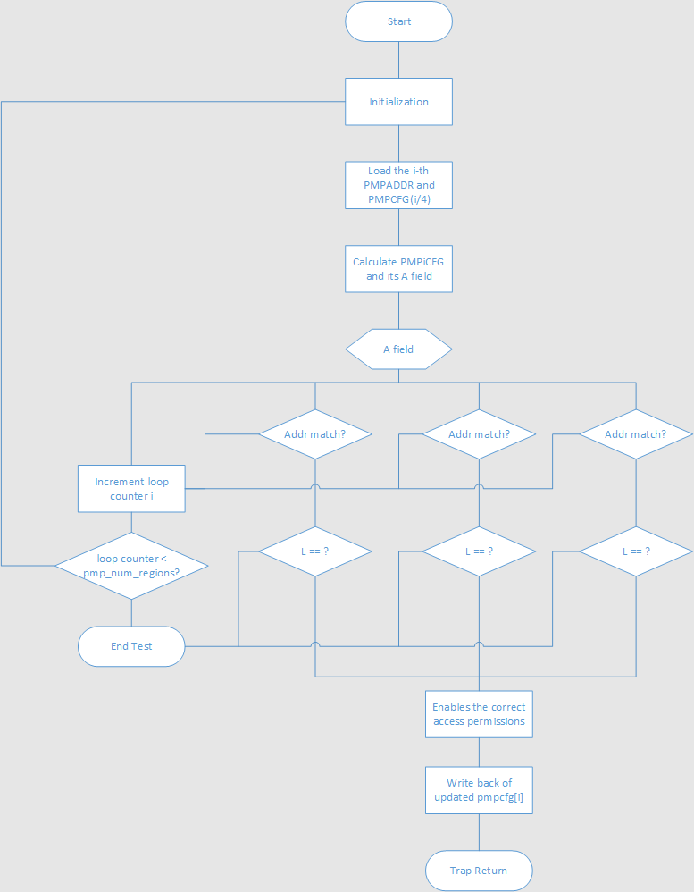

## Handshake between testbench and DUT
RISCV-DV also defines handshake protocol and corresponding instruction stream for the comminication between testbench and tested core. The [online doc](https://htmlpreview.github.io/?https://github.com/google/riscv-dv/blob/master/docs/build/singlehtml/index.html) well explained the details.

Enabling bit `cfg.require_signature_addr` turns on/off of the handshake functionality. If it is set, function `riscv_asm_program_gen::gen_signature_handshake()` can generate the proper sequence of handshake instructions to signal the testbench.

The handshake is carried out by writes to the address specified by `cfg.signature_addr`. The default address is 32'hdeed_beef, and can be configured via command line option +signature_addr. Writes to the signature address work like transmission by MMIO.

The memory interface of testbench should implement features that monitors the the writes to signature and collects data according to types of signature.

The four types of signature information that core can send to testbench is described in src/riscv_signature_pkg.sv, which are illustrated in the figure below. They are used to check internal stautus of a core in the situation such as handling exceptions/interrupts or changing privileged mode.

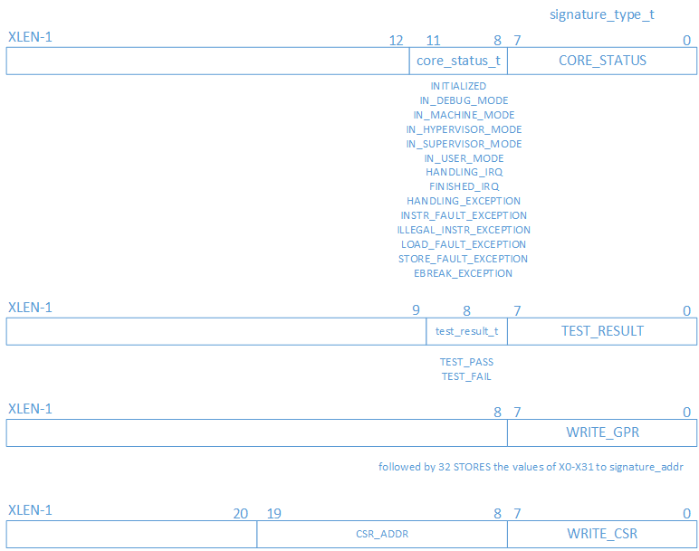

## Instruction generation flow

```plantuml
@startuml
partition "Entry and Trampoline" {
    (*) --> "gen header"
    note right 
    - set entry label `_start`
    - start of section .text
    - trampoline to lable "h%d_start" 
      according to HARTID
    endnote
    if "Bare mode program?" then
    -->[no]  == Privil ==
    else
    -->[yes] == Init ==
    endif
}
partition "Enter Privileged mode" {
   == Privil == -->  "- initialize kernel SP
   - create page table
   - gen PMP layout
   - set up privileged CSRs
   - MRET to target privileged mode"
   note right
   **Initialized CSRs:**
   misa;
   medeleg, mideleg;
   sedeleg, sideleg;
   mtvec, stvec, utvec;
   pmpcfg, pmpaddr;
   satp;
   epc;
   mstatus, mie;
   sstatus, sie;
   etc..
   endnote
   --> == Init ==
}

partition "Init" {
   == Init == -->  "initialize:
   - GPRs
   - (optionally) FPRs
   - (optionally) VPRs"
   if "PMP enabled?" then
   --> [yes] == TRAP ==
   else
   --> == Mainbody ==
}


partition "Trap Handler" {
    == TRAP == --> "generate trap handles:
    - dispatch code
    - exception handler
    - ecall handler
    - PMP fault (instr/load/stor) handler
    - test-done code"
    --> == Mainbody ==
}

partition "Mainbody" {
    == Mainbody == --> "generate sub programs"
    --> "generate main program"
    note right
    procedures to program gen:
    - generate directed streams
    - generate random stream
    - (optionally) stack enter/exit instr
    - insert directed stream
    - set targets for BRANCH
    endnote
    --> "create call stack"
    --> "Combine instr stream of main body"
}

partition "Data/Stack Sections" {
    --> "gen user data page"
    note right
    - creat data section according to 
      `cfg.mem_region`.
    - HTIF "tohost" and "from_host" is at
      the top.
    - `cfg.amo_region` is shared among harts,
      and created by hart0 only
    endnote
    --> "gen user stack page"
    --> "gen kernel program section"
    note right
    - generate random instruction as kernel program
      (use to test kernel pages, not actually run)
    - generate trap handler
      - if PMP is not enable, previous PMP related
        handlers are generated here. (including 
        dispatch code; handlers of exception, 
        ecall, PMP fault of instr/load/store)
    - handlers of ebreak, illegal instruction,
      page table related.
    endnote
    --> "gen kernel data section"
    note right
    - creat data section according to 
      `cfg.s_mem_region`.
    endnote
    --> "gen kernel stack section"
    --> "gen page table"
}
@enduml
```
TODO: Add description of memory map of a test case. There is a reference slide in [3].

## Appendix
### Setting up privileged CSR registers
Let's begin with how privileged registers are defined. First class `riscv_reg_field` is used to model a register field.
```plantuml
@startuml
class riscv_reg_field{
    + bit_width : int unsigned
    + reset_val : bit [XLEN-1:0]
    + val : rand bit [XLEN-1:0]
    + access_type : reg_field_access_t
    + hard_wired : bit
    .. constraints ..
    ...
    --
    + convert2string()
    + post_randomize()
}
note right of riscv_reg_field::access_type
typedef enum bit [1:0] {
    WPRI, // Reserved Writes Preserve Values, Reads Ignore Value
    WLRL, // Write/Read Only Legal Values
    WARL  // Write Any Values, Reads Legal Values
  } reg_field_access_t;
endnote
note left of riscv_reg_field::post_randomize
zero unused heading bits
endnote
uvm_object <|-- riscv_reg_field
@enduml
```
Then class `riscv_reg` uses instances of above field class to define privileged registers, which is parameterized by `(type REG_T = privileged_reg_t)`.

```plantuml
@startuml
class riscv_reg{
    + reg_name : REG_T
    + offset : riscv_csr_t
    + privil_level : privileged_level_t
    + val : bit [XLEN-1:0]
    + fld[$] : rand riscv_reg_field
    --
    + init_reg()
    + reset()
    + get_val()
    + set_val()
    + add_field()
    + set_field()
    + reset()
}
note right of riscv_reg::offset
Enumerated value of `riscv_csr_t`,
which is the CSR addr.
endnote
note right of riscv_reg::privil_level
typedef enum bit [1:0] {
    M_LEVEL = 2'b11,  // Machine mode
    S_LEVEL = 2'b01,  // Supervisor mode
    U_LEVEL = 2'b00   // User mode
  } privileged_level_t;
endnote
note left of riscv_reg::init_reg
initialize `reg_name` and `offset`,
which set it to a specific priviledged
register
endnote
note left of riscv_reg::get_val
return val from fields `fld[$]`
endnote
note left of riscv_reg::set_val
assign internal fields `fld[$]`
according to argument val
endnote
note left of riscv_reg::add_field
create a new instance of
`riscv_reg_field` and append
it to `fld[$]`.
endnote
note left of riscv_reg::set_field
override the value of specified
field, use `reset_val` if `hard_wired`
is set.
endnote
note right of riscv_reg::reset
reset `val`of each
field by `reset_val`
endnote
uvm_object <|-- riscv_reg
@enduml
```

Next, the class for privileged registers `riscv_privil_reg` is a subclass of `riscv_reg`.

```plantuml
@startuml
class riscv_privil_reg{
    + init_reg()
}
note right of riscv_privil_reg::init_reg
Given the `reg_name` of privileged_reg_t,
- call `super.init_reg()` to initialize `reg_name` and `offset`
- initialize `privil_level`
- add fields by invoking `add_field()` several times
endnote
riscv_reg <|-- riscv_privil_reg
@enduml
```
By using the classes above, class `riscv_privileged_common_seq` provides some common routines for privileged mode operations. 

```plantuml
@startuml
class riscv_privileged_common_seq{
    + cfg : riscv_instr_gen_config
    + hart : int
    .. privileged regs ..
    + mstatus : riscv_privil_reg
    + mie : riscv_privil_reg
    + sstatus : riscv_privil_reg
    + sie : riscv_privil_reg
    + ustatus : riscv_privil_reg
    + uie : riscv_privil_reg
    --
    + enter_privileged_mode()
    + setup_mmode_reg()
    + setup_smode_reg()
    + setup_umode_reg()
    + gen_csr_instr()
    + setup_satp()
}
note right of riscv_privileged_common_seq::enter_privileged_mode
- Initialize fields of members `mstatus`, `mie`,
  `sstatus`, `sie`, `ustatus` and `uie`
  by `setup_mmode_reg()`, `setup_mmode_reg()` and
  `setup_mmode_reg()` respectively
- call `gen_csr_instr()` to generate CSR write 
  instructions for initialization
- Prepend instructions to set up SATP if 
  `cfg.virtual_addr_translation_on` is set,
  which calls `setup_satp()`
- Append "mret" isntruction to switch to
  the target privileged mode
endnote
note left of riscv_privileged_common_seq::setup_mmode_reg
- create instances for `mstatus` and `mie`, and initialize
  initially by `init_reg()`
- Set fields according to `cfg` by invoking `set_field()`
endnote
note right of riscv_privileged_common_seq::gen_csr_instr
- call `get_val()` to form `val` of register
- use `LI` and `CSRW` instructions for CSR initialization
endnote
note right of riscv_privileged_common_seq::setup_satp
generate instructions to set up SATP that points
to the address of label "page_table_0"
endnote
uvm_sequence <|-- riscv_privileged_common_seq
@enduml
```
Note on usage:
- `enter_privileged_mode()` is employed in `riscv_asm_program_gen::gen_privileged_mode_switch_routine()' to set up privileged mode registers before switching to target privileged mode and jump to init section.
- 

### Kernel SP:
- `cfg.tp` is used as the kernel SP. In `riscv_asm_program_gen::pre_enter_privileged_mode()`, it sets up kerenal stack pointer by section "h%(hart_id)_kernel_sp" which assigns `cfg.tp` using the address of "h%(hart_id)kernel_stack_end".
- It is the reason that in `riscv_instr_pkg::push_gpr_to_kernel_stack()`, TP is moved to SP before push GPRs to stack, as well as in `riscv_instr_pkg::pop_gpr_from_kernel_stack()`, SP is moved to TP before restore user mode SP by switching SCRATCH ans SP.

## References
[1] [Source code at Github](https://github.com/google/riscv-dv)

[2] [Online document](https://htmlpreview.github.io/?https://github.com/google/riscv-dv/blob/master/docs/build/singlehtml/index.html)

[3] [Talk at RISC-V Summit 2018](https://www.youtube.com/watch?v=9y_4ucNO04U)

[4] [Talk at RISC-V Summit 2019](https://www.youtube.com/watch?v=st_ZiRHuNbU)